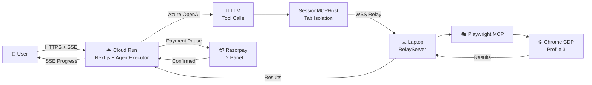
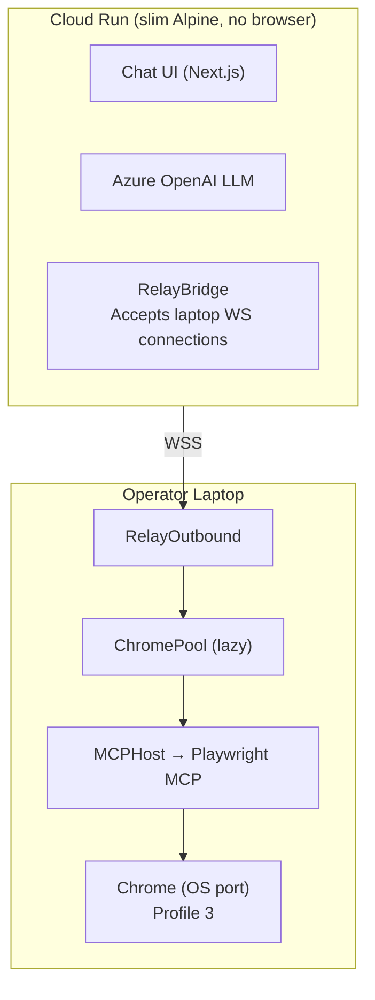

# ShofferAI

Concierge-as-a-service: AI assistant that executes real-world web tasks (hotel booking, grocery ordering) on behalf of users. The operator's laptop runs Playwright with signed-in browser profiles; the web app deploys to GCP Cloud Run.

## Architecture Overview



**Key principles**:
- **Azure OpenAI** handles all chat, reasoning, and tool calling (via `openai` npm package with Azure endpoint)
- **Playwright MCP** runs on the operator's laptop — browser automation is never on Cloud Run
- **SessionMCPHost** wraps every task with a unique `sessionId` for Chrome tab isolation
- **Two relay modes**: Dev (`RemoteMCPHost` connects OUT) vs Prod (`RelayBridge` accepts IN)
- **Login first**: Every website interaction starts by logging into the target site
- **New tab for every site**: Agent opens a new tab, never hijacks the user's chat tab

## Tech Stack
- **Monorepo**: Turborepo with npm workspaces
- **Frontend**: Next.js 15 (App Router) + Tailwind CSS 4 + shadcn-style components
- **Auth**: Auth.js v5 (NextAuth) with credentials + Google OAuth
- **Database**: PostgreSQL via Prisma ORM (Cloud SQL in prod)
- **LLM**: Azure OpenAI via `openai` npm package (with Anthropic format translation layer)
- **Browser Automation**: Playwright MCP via @modelcontextprotocol/sdk (runs on operator laptop only)
- **Relay**: WebSocket relay — dev: `RemoteMCPHost` connects out; prod: `RelayBridge` accepts laptop connections in
- **Tab Isolation**: `SessionMCPHost` + `ChromePool` — per-task Chrome tabs
- **Payments**: Razorpay (UPI, cards, net banking, wallets)
- **Deployment**: Google Cloud Run + Cloud SQL

## Project Structure
```
apps/
  web/                 → Chat Interface (Cloud Run): Next.js, auth, payments, relay
    lib/
      credential-vault/  → AES-256-GCM encrypted credential storage
      workflow-engine/    → Task state machine + pause/resume (PauseResumeManager)
      relay-client.ts     → RemoteMCPHost: WS client (dev mode, cloud connects OUT)
      relay-bridge.ts     → RelayBridge: accepts laptop WS IN (prod mode)
      session-mcp-host.ts → SessionMCPHost: per-task tab isolation wrapper
      remote-mcp-host.ts  → MCP host via relay (implements MCPHostLike)
  playwright/          → Playwright Interface (Operator Laptop): relay server, MCP host
    src/
      mcp-host.ts         → Local Playwright MCP connection (implements MCPHostLike)
      relay-server.ts     → WebSocket server for cloud connections
    scripts/              → Chrome debug, laptop starter, MCP config
packages/
  agent-core/          → Azure OpenAI LLM client + MCP tool loop + system prompts + skills + lessons
    src/
      agent.ts           → AgentExecutor (LLM loop, tool dispatch, lesson save/load)
      azure-openai-client.ts → AzureOpenAIClient (openai npm + Azure endpoint)
      conversation.ts    → ConversationManager (max 20 msgs, 4000 char truncation)
      prompts/system.ts  → buildSystemPrompt() with user context + skills + lessons
      skills/types.ts    → SkillMetadata, LessonStore, LessonEntry interfaces
      skills/loader.ts   → Skill loading + matchSkill() scoring
      skills/lessons.ts  → formatLessonsForPrompt()
  shared/              → Types, logger, errors, relay protocol, MCPHostLike interface
    src/
      relay.ts           → RelayMessage protocol types
      mcp.ts             → MCPHostLike interface (implemented by all MCP classes)
      credentials.ts     → CardData, UPIData, SiteLoginData, AddressData types
prisma/                → Database schema + migrations (PostgreSQL, 10 models)
docs/                  → PRD, Architecture, Pitch, Workflows + Mermaid diagrams
```

## Development Commands
```bash
# Start chat interface (web)
cd apps/web && npx next dev

# Start laptop relay (ChromePool + relay — connects to Cloud Run)
./apps/playwright/scripts/start-laptop.sh

# Database
npx prisma migrate dev      # Run migrations
npx prisma studio           # Open DB browser
npx prisma generate         # Regenerate client

# Build
npx turbo build             # Build all packages
```

## Production Architecture



**Two Relay Modes:**
- **Dev** (no `RELAY_CLOUD_URL`): `RelayServer` listens on `ws://localhost:8765`, Cloud Run's `RemoteMCPHost` connects OUT to it
- **Prod** (`RELAY_CLOUD_URL` set): `RelayOutbound` connects directly to Cloud Run via WSS — **no tunnel needed**, no port 8765
- **Both modes**: `TaskManager` bridge WS always listens on port **9400** (range 9400-9499)

**LLM's role**: Chat with user, reason about steps, call MCP tools via relay. The LLM NEVER touches the browser directly — it sends tool calls that get relayed to the laptop's Playwright MCP.

**Laptop's role**: Execute ALL browser actions. ChromePool launches Chrome on demand with Profile 3 (signed-in sessions). Chrome gets an OS-assigned ephemeral port — no hardcoded ports. `ChromePool` isolates each task into a separate Chrome instance.

## Chrome Profile (One-Time Setup)

ChromePool and Playwright MCP both clone the base `Chrome-Debug` profile directory automatically. You only need to set up the base profile once:

**Profile**: `Profile 3` → `rsinghtomar3011@gmail.com` (Booking.com Genius account)

**Base user-data-dir**: `~/Library/Application Support/Google/Chrome-Debug`

**Profiles in Chrome-Debug:**
- `Default` — empty, no account
- `Profile 1` — rsinghtomar54@gmail.com
- `Profile 3` — rsinghtomar3011@gmail.com (Booking.com Genius Level 1) ← **USE THIS**
- `Profile 4` — rohit30.iitkgp@gmail.com (wrong account, do not use)

**How Chrome launching works (both paths):**
1. Clone the base Chrome-Debug user-data-dir (APFS instant clone or session file copy)
2. Remove singleton lock files from the clone
3. Launch Chrome with `--remote-debugging-port=0` — OS assigns a free ephemeral port
4. Parse actual port from Chrome's stderr (`DevTools listening on ws://127.0.0.1:PORT/...`)
5. Connect Playwright MCP via CDP to that port

**Why this works:** Chrome encrypts cookies via macOS Keychain (per-user, NOT per-user-data-dir). So cloned dirs can decrypt all cookies — the new Chrome instance is fully signed in.

**If sessions expire:** Open the base Chrome-Debug manually, sign in again. All future clones pick up the new sessions.

## Booking.com Skill (v2)

Full E2E flow: Search → Select Hotel → Select Room → Fill Details → Payment Pause → Complete Booking → Confirmation

**Files:**
- `packages/agent-core/src/scripts/compiled/booking-com-hotel.v2.json` — 13-step declarative skill
- `packages/agent-core/src/scripts/compiled/booking-com-hotel.ts` — Compiled Playwright script
- `packages/agent-core/src/scripts/mcp-executor.ts` — MCP-based executor (12 steps)

**Booking.com data-testid selectors:**
```
[data-testid="property-card"]              — hotel search result card
[data-testid="title"]                      — hotel name in card
[data-testid="price-and-discounted-price"] — price in card
[data-testid="review-score"]               — review score in card
[data-testid="title-link"]                 — hotel detail link in card
[data-testid="user-details-firstname"]     — first name field
[data-testid="user-details-lastname"]      — last name field
[data-testid="user-details-email"]         — email field
[data-testid="phone-number-input"]         — phone field
```

## Blinkit Grocery Skill

Full E2E flow: Ask Address → Open Blinkit → Login (phone+OTP) → Search Items → Add to Cart → Review → Checkout → Place Order

**File:** `packages/agent-core/src/skills/definitions/blinkit-grocery.ts`

**Flow:**
1. Ask user for delivery address (via `ask_user`)
2. Open new tab → navigate to blinkit.com
3. Set delivery location
4. Login with phone number + OTP
5. Search & add each item (user picks variants)
6. Review cart → `confirm_action` (WAIT for user Yes/Cancel)
7. Checkout & payment → `confirm_action` (WAIT again)
8. Place order → report confirmation

**Important**: Login MUST happen before searching products. If skipped, Blinkit blocks checkout with a login wall.

## Key Architecture Decisions
- **Concierge model**: Operator uses own signed-in browser profiles to book on behalf of users
- **Azure OpenAI**: Single LLM provider — via `openai` npm package with Azure endpoint + Anthropic format translation
- **Relay pattern**: `MCPHost` (local stdio) vs `RemoteMCPHost` (dev WS) vs `RelayBridge` (prod WS) — all implement `MCPHostLike`, zero agent-core changes
- **Tab isolation**: `SessionMCPHost` wraps MCPHostLike with per-task `sessionId` → `ChromePool` maps to Chrome tabs
- **Login first**: Every website interaction MUST start by logging into the target site
- **New tab for every site**: Agent ALWAYS opens a new browser tab before navigating to external sites. The user's chat tab must never be hijacked.
- **Auto-ask_user**: If the LLM outputs a question as text instead of calling the `ask_user` tool, the agent auto-converts it to an interactive input prompt
- **Payment before booking**: Agent pauses via `PauseResumeManager`, L2 panel collects Razorpay payment, agent resumes
- **SSE streaming**: Real-time agent progress updates to the UI
- **Direct relay**: Laptop connects OUT to Cloud Run via WSS (`RelayOutbound`) — no Cloudflare Tunnel needed

## Playwright MCP — Chrome Launching

Both the `.mcp.json` path (local dev/Copilot) and the relay path (production) launch Chrome the same way: clone the profile, `--remote-debugging-port=0`, parse the actual port from stderr.

### Path A: `.mcp.json` (local Copilot / Claude Desktop)

`.mcp.json` calls `apps/playwright/scripts/playwright-mcp-with-chrome.sh` which:
1. Generates a unique instance ID (`mcp-$$-timestamp`)
2. **APFS-clones** the entire `Chrome-Debug` user-data-dir
3. Removes stale lock files from the clone
4. Launches Chrome with `--remote-debugging-port=0` — OS assigns a free port
5. Parses actual port from Chrome's stderr (`DevTools listening on ws://127.0.0.1:PORT/...`)
6. `exec`s into `npx @playwright/mcp@latest --cdp-endpoint http://127.0.0.1:<port>`
7. Cleanup trap kills Chrome + removes clone on exit

### Path B: ChromePool (relay / production)

`ChromePool` in `apps/playwright/src/chrome-pool.ts`:
1. **Lazy mode** — starts with 1 warm slot (for tool discovery), rest launch on demand
2. Each slot: copies session files → launches Chrome with `port=0` → parses port from stderr → connects MCPHost
3. Slots auto-release after 15 min idle, Chrome torn down after 30 min unused
4. Max concurrent slots controlled by `POOL_SIZE` env var (default: 3)

### `.mcp.json`:
```json
{
  "mcpServers": {
    "playwright": {
      "type": "stdio",
      "command": "bash",
      "args": ["apps/playwright/scripts/playwright-mcp-with-chrome.sh"]
    }
  }
}
```

### Rules:
1. **Never launch Chrome manually** — ChromePool and the wrapper script handle everything.
2. **Always a new instance** — every invocation gets its own Chrome window on an OS-assigned port.
3. **Always signed in** — profile clone guarantees rsinghtomar3011@gmail.com Profile 3 with all cookies/sessions.
4. **IPv4 only** — always `127.0.0.1`, never `localhost` (macOS resolves localhost to IPv6).
5. **No hardcoded ports** — `--remote-debugging-port=0` lets the OS pick. No port conflicts ever.

## Mandatory Skills
- **Always activate /cofounder mode at the start of every conversation** before doing any work
- **After ANY UI change, run /dev-loop** to self-test with Playwright MCP — no exceptions
- **When creating a new E2E workflow/skill, use /e2e-flow** — browse once, auto-compile, replay instantly

## Testing Workflow

**E2E / Agent Testing**: Always use the **real production website**, not localhost:
- **Prod URL**: `https://shofferai-27188185100.asia-south1.run.app`
- Log in with real credentials (not test accounts)
- Mimic actual user flow: landing page → login → chat → send request → watch agent execute
- **E2E means END TO END**: Complete every action until the conversation is fully done
- **Login first on every site**: Before any browsing, the agent must login to the target website

**Before testing, ensure laptop relay is running:**
```bash
./apps/playwright/scripts/start-laptop.sh
```

**UI Development**: Use `localhost:3000` only for frontend iteration. After UI changes, deploy and verify on prod.

## Environment
- `.env` at root — see `.env.example` for all variables
- `AZURE_OPENAI_ENDPOINT` — Azure OpenAI resource endpoint
- `AZURE_OPENAI_API_KEY` — Azure OpenAI API key
- `LLM_MODEL` — Azure deployment name (default `gpt-5.1-chat`)
- `RELAY_MODE=local` for dev, `RELAY_MODE=cloud` for production
- Dev server on port 3000, relay server on port 8765 (server mode) or outbound to Cloud Run (prod mode), TaskManager bridge always on port 9400

## Docs
- `docs/PRD.md` — Product requirements document
- `docs/ARCHITECTURE.md` — Detailed system architecture with Mermaid diagrams
- `docs/WORKFLOWS.md` — E2E workflow documentation per skill
- `docs/DEPLOYMENT.md` — What runs on Cloud Run vs laptop, startup guide
- `docs/PITCH.md` — Investor pitch deck
- `docs/diagrams/` — Mermaid source files (.mmd) + PNG/SVG images
