# ShofferAI — System Architecture

> **Version**: 3.0 — Full Architecture with Diagrams
> **Last Updated**: March 21, 2026

---

## 1. High-Level System Architecture

The system spans two environments connected by a WebSocket relay:

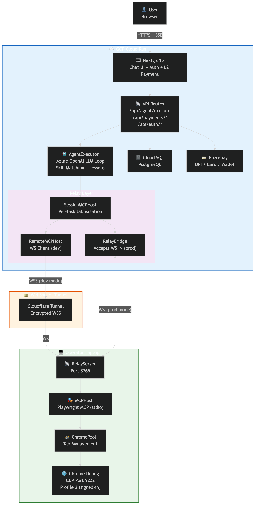

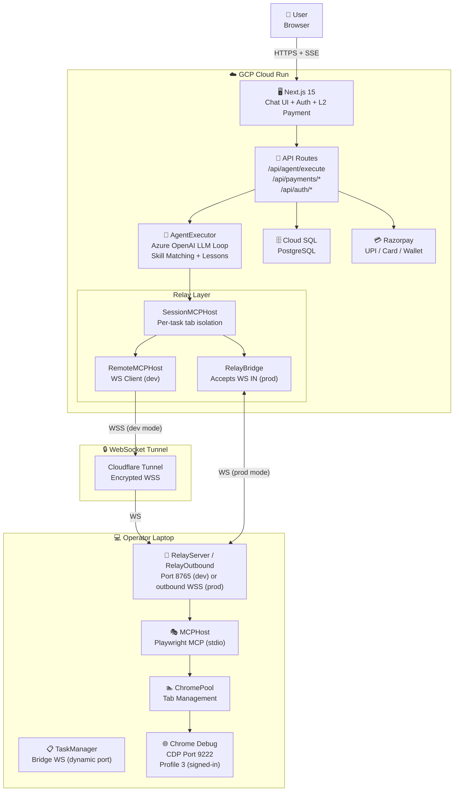

### Key Principles
- **Azure OpenAI** handles all chat, reasoning, and tool calling (via `openai` npm package with Azure endpoint)
- **Playwright MCP** runs exclusively on the operator's laptop — browser automation never runs on Cloud Run
- **Login first**: Every website interaction starts by logging into the target site
- **New tab for every site**: Agent opens a new tab per task, never hijacks the user's chat tab
- **SessionMCPHost**: Each task gets an isolated Chrome tab via ChromePool

---

## 2. Relay Architecture — Dev vs Prod

The relay supports two modes depending on `RELAY_MODE` environment variable:

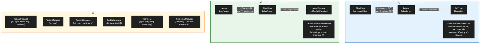

```mermaid
graph TB
    subgraph DEV["🔧 Dev Mode (no RELAY_CLOUD_URL)"]
        direction LR
        C1["Cloud Run<br/>RemoteMCPHost"] -->|"1. Connects OUT<br/>ws://localhost:8765"| L1["Laptop<br/>RelayServer"]
        L1 -->|"2. Accepts connection"| M1["MCPHost<br/>Playwright"]
    end
    
    subgraph PROD["🚀 Prod Mode (RELAY_CLOUD_URL set)"]
        direction LR
        L2["Laptop<br/>RelayOutbound"] -->|"1. Connects OUT<br/>wss://cloud-run-url"| C2["Cloud Run<br/>RelayBridge"]
        C2 -->|"2. setLaptopSocket()"| A2["AgentExecutor<br/>callToolWithSession()"]
    end
    
    subgraph ALWAYS["📋 Always Running"]
        direction TB
        TM["TaskManager bridge<br/>WS on dynamic port (9400-9499)"]
    end
    
    subgraph PROTO["📋 Shared Relay Protocol"]
        direction TB
        REQ1["ToolCallRequest<br/>{id, type, name, args, sessionId}"]
        RES1["ToolCallResponse<br/>{id, type, result, error}"]
        HB["Heartbeat<br/>{type: ping|pong, timestamp}"]
        SE["SessionEndRequest<br/>{sessionId} → release Chrome slot"]
    end
```

| Mode | Who Initiates | Class | Use Case |
|------|--------------|-------|----------|
| **Dev** (no `RELAY_CLOUD_URL`) | Cloud connects OUT | `RemoteMCPHost` (`apps/web/lib/relay-client.ts`) | Local development, ws://localhost:8765 |
| **Prod** (`RELAY_CLOUD_URL` set) | Laptop connects OUT | `RelayOutbound` (`apps/playwright/src/relay-outbound.ts`) | Production, no Cloudflare Tunnel needed |
| **Both modes** | TaskManager bridge | `TaskManager` (`apps/playwright/src/task-manager.ts`) | Dynamic port (first available in 9400-9499 range, printed in logs) |

**Shared Protocol** (defined in `packages/shared/src/relay.ts`):
- `ToolCallRequest` / `ToolCallResponse` — UUID-correlated tool execution
- `ToolListRequest` / `ToolListResponse` — Discover available MCP tools
- `SessionEndRequest` — Release Chrome tab slot
- `Heartbeat` — 15s server ping, laptop responds with pong. Used for stale connection detection (see below).

**Deploy Auto-Heal** — The relay survives Cloud Run deploys automatically via five layers:
1. **Pre-deploy release** (`cloudbuild.yaml` Step #1): Before deploying a new revision, Cloud Build curls `POST /api/admin/release-relay` on the current instance. This force-closes the laptop WS, so the laptop reconnects to the new instance within 1-4s.
2. **Draining guard** (`custom-server.js`): On SIGTERM, sets `draining = true` and rejects all new WS upgrade requests with HTTP 503. This prevents the laptop from reconnecting to the dying old instance during the 1-4s reconnect window.
3. **`server_draining` message** (`relay-bridge.ts`): On SIGTERM, `gracefulClose()` sends a `{ type: 'server_draining' }` message to the laptop BEFORE the WS close frame. The laptop handles this by immediately terminating the WS and reconnecting with 1s delay — even if the close frame is delayed or lost.
4. **Stale connection detection** (`relay-outbound.ts`): The laptop tracks application-level messages separately from WS-level pong frames. Cloud Run's load balancer responds to WS pings even when the backend instance is dead, so WS pongs alone can't detect staleness. If no app-level message arrives for 25s, the laptop terminates and reconnects.
5. **HTTP phantom detection** (`relay-outbound.ts`): Every 30s (and 8s after each new connection), the laptop GETs `GET /api/admin/relay-status` via HTTP. HTTP always routes to the ACTIVE Cloud Run instance. If it returns `connected: false` but the laptop's WS is open, the laptop is connected to a draining/phantom instance → terminates WS and reconnects. This is the definitive fix for FM2 (draining instance sending heartbeat pings that fool the stale check).

**MCPHostLike Interface** — Both `MCPHost`, `RemoteMCPHost`, `RelayBridge`, and `SessionMCPHost` implement the same interface. `AgentExecutor` accepts any — zero changes to agent-core when switching modes.

```typescript
interface MCPHostLike {
  callTool(name: string, args: Record<string, unknown>): Promise<unknown>;
  getTools(): Promise<MCPTool[]>;
  isMCPTool(name: string): boolean;
  disconnect?(): Promise<void>;
}
```

---

## 3. Request Lifecycle — End-to-End

What happens when a user sends "Book hotel in Mumbai":

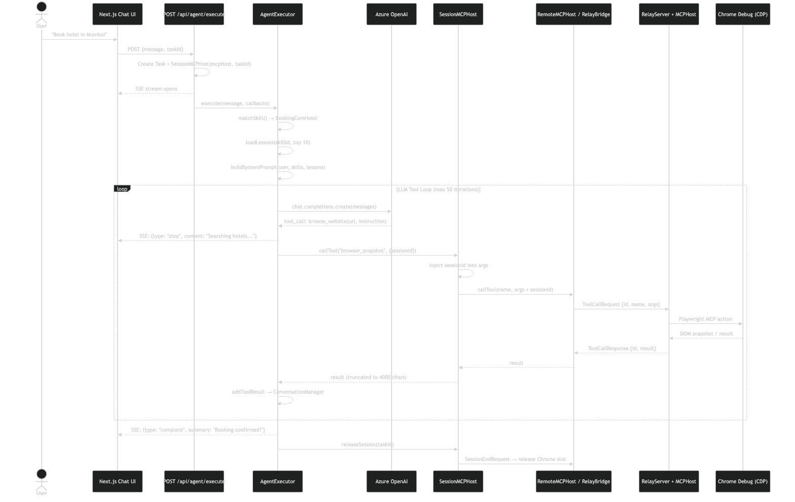

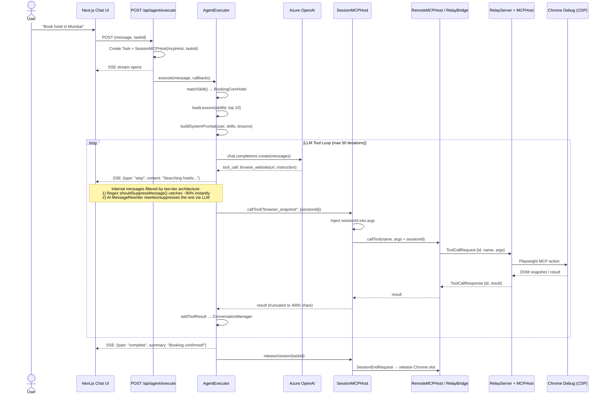

### Key Classes in the Flow

| Class | File | Role |
|-------|------|------|
| **AgentExecutor** | `packages/agent-core/src/agent.ts` | LLM loop (max 50 iterations), skill matching, tool dispatch |
| **MessageRewriter** | `packages/agent-core/src/message-rewriter.ts` | AI rewrite layer — classifies browser agent messages via LLM, suppresses narration or rewrites into user-facing text |
| **ConversationManager** | `packages/agent-core/src/conversation.ts` | Message history (max 20 messages, tool results truncated to 4000 chars) |
| **AzureOpenAIClient** | `packages/agent-core/src/azure-openai-client.ts` | Azure OpenAI via `openai` npm package, translates internal Anthropic format ↔ OpenAI API |
| **SessionMCPHost** | `apps/web/lib/session-mcp-host.ts` | Per-task wrapper, injects `sessionId` for tab isolation |
| **WorkflowEngine** | `apps/web/lib/workflow-engine/engine.ts` | Task state machine: `createTask()`, `updateTaskStatus()`, `addMessage()` |
| **PauseResumeManager** | `apps/web/lib/workflow-engine/pause-resume.ts` | Blocks agent for user input (5 min default timeout) |

### Execution Modes

| Mode | Trigger | How It Works |
|------|---------|-------------|
| **AI Mode** | No compiled script exists | LLM reasons through each step, calls MCP tools |
| **Instant Mode** | Compiled script found | `ScriptPlayer` replays pre-recorded Playwright steps |
| **Hybrid** | Script fails mid-execution | Falls back to AI mode, enables `ScriptRecorder` to save new script on success |

---

## 4. Tab Isolation — SessionMCPHost + ChromePool

Each concurrent task gets its own Chrome tab via `SessionMCPHost`:

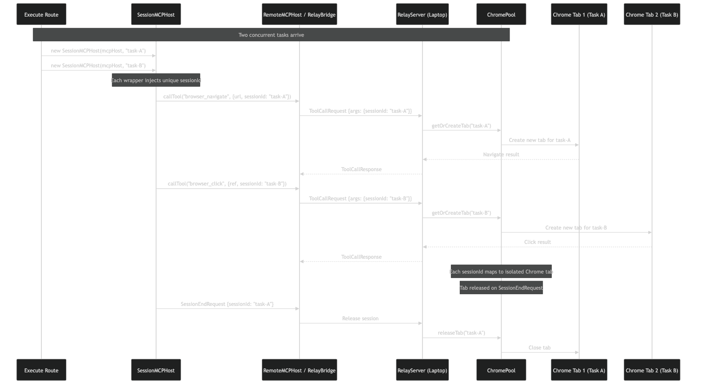

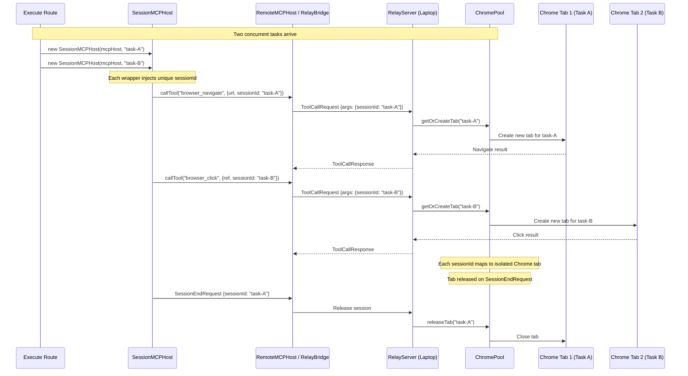

**How it works:**
1. `POST /api/agent/execute` creates `new SessionMCPHost(remoteMcpHost, taskId)`
2. Every `callTool()` call atomically injects `sessionId` into tool arguments
3. On the laptop, `ChromePool` maps each `sessionId` to a unique Chrome tab
4. When task completes, `SessionEndRequest` releases the tab back to the pool
5. On cancellation (user closes tab / new chat), `TaskManager.cleanupTask()` calls `chromePool.releaseSlot(sessionId)` to immediately free the Chrome slot — no waiting for idle TTL

### Task Cancellation Flow

When a user clicks "New Chat" or closes the browser tab/window, a cancel signal propagates to the laptop to kill the Copilot CLI process and its Chrome instance:

```
User closes tab / clicks "New Chat"
  → beforeunload event fires in browser
  → fetch('/api/agent/cancel', {keepalive: true}) with taskId
  → Cancel endpoint: remoteMcpHost.sendTaskMessage({type: 'task_cancel', taskId})
  → If relay connected: sent immediately via WebSocket
  → If relay disconnected: queued in pendingCancels Set, flushed on reconnect
  → Laptop TaskManager.cleanupTask(): SIGCONT + SIGTERM to process group
  → Copilot CLI + Chrome both killed
```

**Key design decisions:**
- `fetch()` with `keepalive: true` (not `sendBeacon`) — survives page teardown with proper `Content-Type: application/json` headers
- Cancel messages are queued in `RelayBridge.pendingCancels` / `RelayClient.pendingCancels` when the relay is offline (e.g. post-deploy reconnection gap) and auto-flushed on WebSocket reconnect
- `SIGCONT` sent before `SIGTERM` — Copilot CLI may be in `SIGSTOP` state (paused for payment); stopped processes ignore `SIGTERM`
- Cloud Run's `request.signal` abort detection is unreliable on HTTP/2 load balancers — the explicit cancel API is the primary mechanism

---

## 5. L2 Split View — Cart + Payment Panels

The L2 split view is a 60/40 layout that slides in from the right for cart review and payment collection. Two mutually exclusive panels share the slot (payment takes priority over cart).

### Cart Flow (Grocery/Shopping)

```
User clicks "ADD" on ProductCardInput → CartContext.addItem(product) [source: 'user'] → CartBar appears
Agent sends cart_update SSE → syncFromAgent() [source: 'agent'] → merges with user items (never overwrites)
User clicks CartBar summary → L2CartContext.openCart() → L2CartPanel slides in (40%)
User reviews items, adjusts quantities → clicks "Proceed to Buy"
L2CartPanel → closeCart() → openL2(paymentData) → PaymentPanel slides in
```

**Components:**
- `CartContext.tsx` — Cart items state (add/remove/update/clear), single-store enforcement. Items tagged with `source: 'user' | 'agent'` — user picks are never overwritten by agent `cart_update` sync
- `L2CartContext.tsx` — Cart panel open/close state machine (`CLOSED → OPENING → OPEN → CLOSING`)
- `CartBar.tsx` — Floating bar showing item count + total; click opens L2CartPanel
- `L2CartPanel.tsx` — Full cart view with quantity ±, price breakdown, "Proceed to Buy"
- `ProductCardInput.tsx` — Rich product card widget with "Add to Cart" button

### Payment Flow (Razorpay)

Agent pauses for payment collection, then resumes:

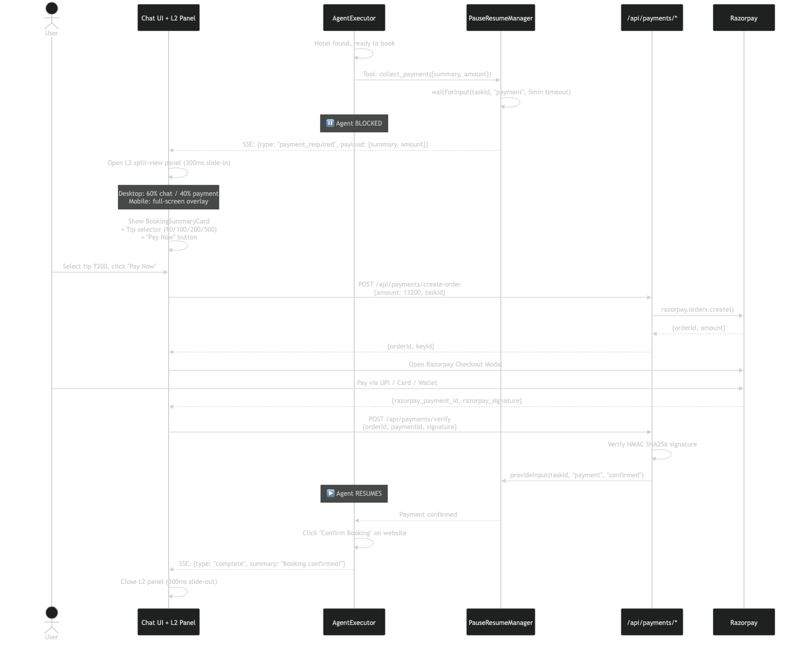

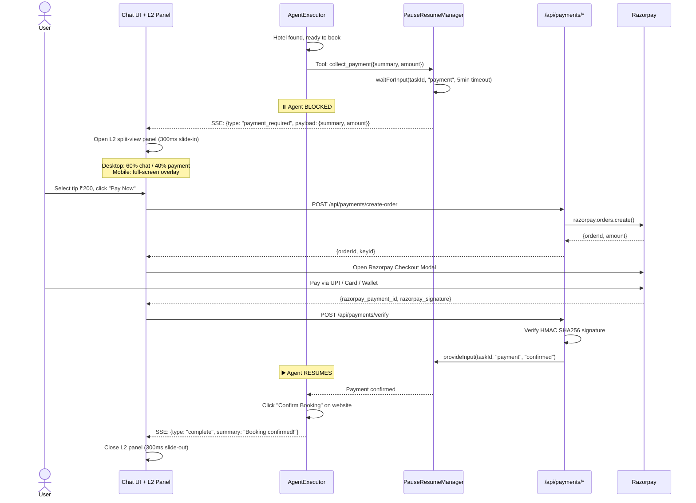

**L2 Window States:**
```
CLOSED → OPENING (300ms slide-in) → OPEN (user pays) → CLOSING (300ms slide-out) → CLOSED
                                         │
                                Desktop: 60/40 split
                                Mobile: full-screen overlay
```

**Components:**
- `L2SplitView.tsx` — Split-view container with animations (payment panel > cart panel priority)
- `L2PaymentContext.tsx` — React context for payment L2 state management
- `L2CartContext.tsx` — React context for cart L2 state management
- `CartContext.tsx` — Cart items, store, totals
- `PaymentPanel.tsx` — Razorpay checkout + booking summary + tip selector
- `BookingSummaryCard.tsx` — Hotel/booking details display
- `InputPrompt.tsx` — OTP and confirmation prompts

### "New Chat" Reset Behavior

Clicking "New Chat" in the sidebar dispatches a `window` event that triggers `resetChat()` in `ChatInterface.tsx`. This clears **all** UI state:

```
Sidebar "New Chat" click
  → window.dispatchEvent(new Event('newchat'))
  → ChatInterface.resetChat()
     → closeL2()     — closes payment panel
     → closeCart()    — closes cart panel
     → clearCart()    — wipes cart items from CartContext
     → setMessages([])
     → setPendingInput(null)
     → setCartItems([]), setCartTotal(''), setCartStore('')
  → Chat returns to welcome screen (100% width, suggestion cards)
```

**Key invariant:** After "New Chat", there must be zero stale L2 state — no open panels, no cart items, no pending inputs.

---

## 6. Skill Matching + Lesson Learning

The agent matches skills by triggers and learns from past errors:

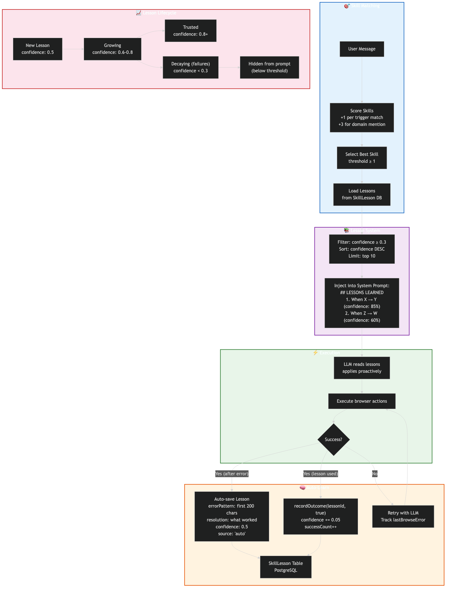

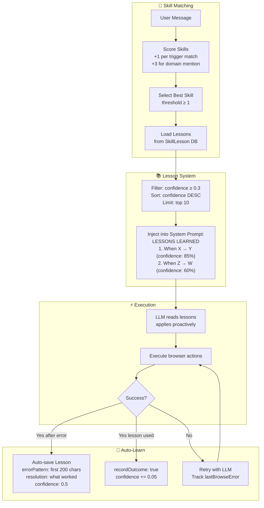

**Lesson Lifecycle:**
1. **New lesson** auto-saved with `confidence: 0.5` on error recovery
2. **Growing** — repeated success bumps confidence by +0.05 per outcome
3. **Trusted** — confidence ≥ 0.8, prioritized in prompt
4. **Decaying** — failures decrease confidence by -0.05
5. **Hidden** — confidence < 0.3, excluded from prompt injection

**Key Files:**
- `packages/agent-core/src/skills/types.ts` — `SkillMetadata`, `LessonStore`, `LessonEntry` interfaces
- `packages/agent-core/src/skills/lessons.ts` — `formatLessonsForPrompt()` function
- `packages/agent-core/src/skills/loader.ts` — Skill loading and `matchSkill()` scoring
- `prisma/schema.prisma` → `SkillLesson` model

---

## 7. Authentication Flow

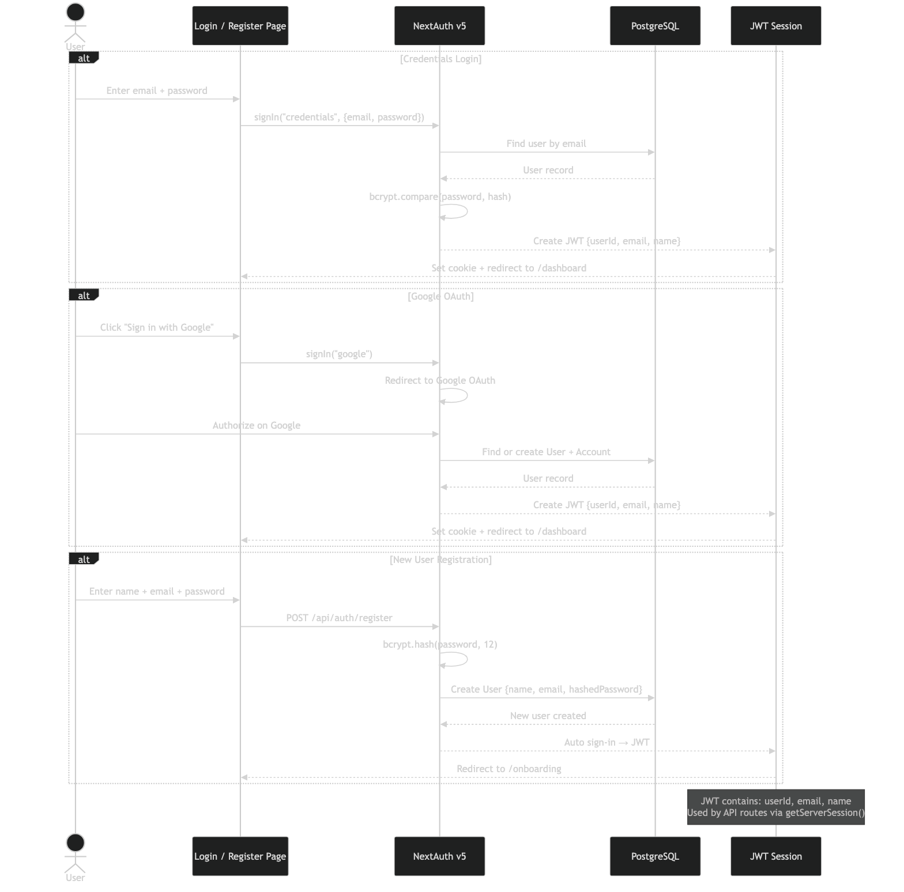

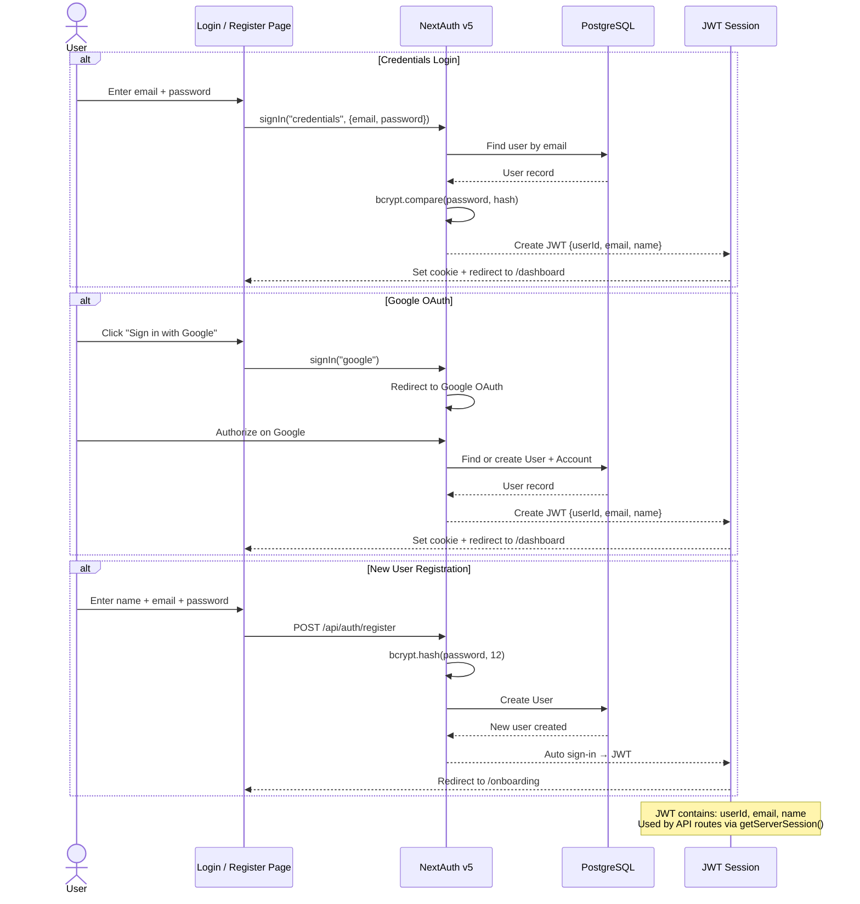

**Auth Stack:**
- **Auth.js v5** (NextAuth) — Credentials + Google OAuth providers
- **JWT sessions** — Stateless, no server-side session storage needed
- **bcrypt** — Password hashing (12 salt rounds)
- **Middleware** — Protected routes redirect to `/login` if no session

---

## 8. Database Schema

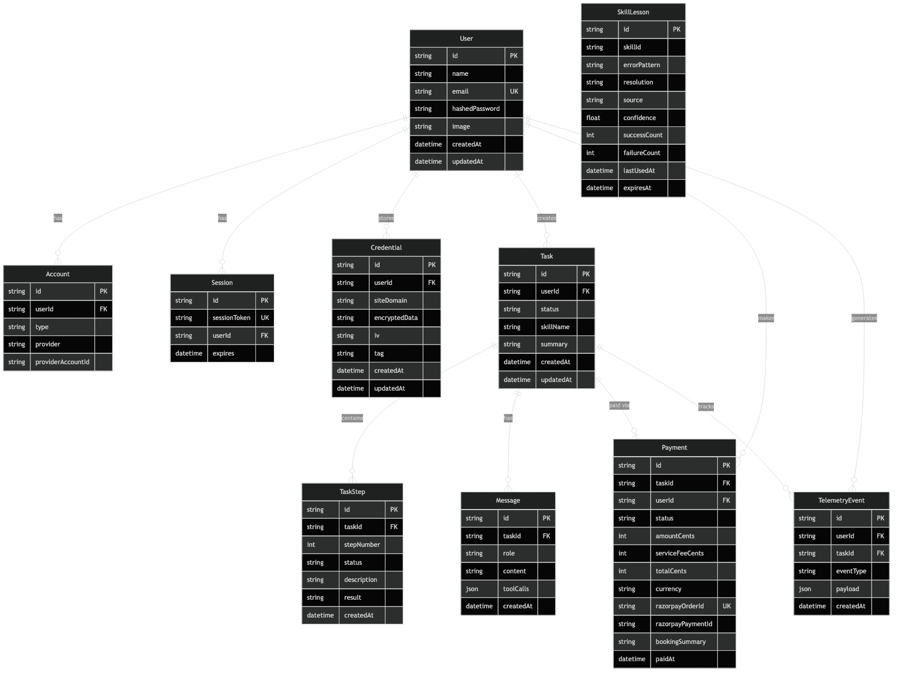

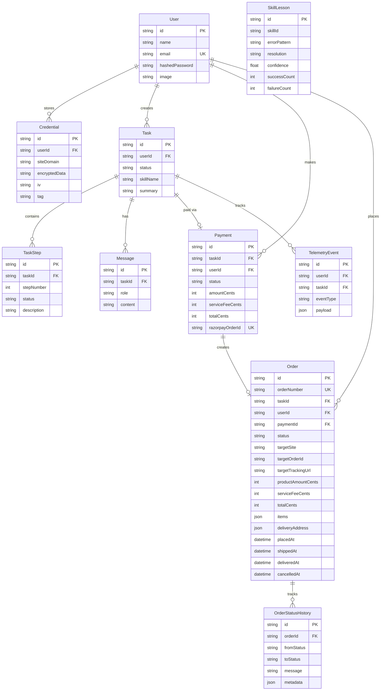

**13 Models** — See `prisma/schema.prisma` for full definitions.

**Credential Vault** (`apps/web/lib/credential-vault/`):
- `vault.ts` — `CredentialVault` class with AES-256-GCM encryption
- `injector.ts` — `CredentialInjector.fill()` securely types credentials into browser forms
- Encrypts site login data, card data, UPI data, and addresses per-user

---

## 9. Package Structure (Actual)

```
shofferai/
├── apps/
│   ├── web/                              ← Chat Interface (Cloud Run)
│   │   ├── app/
│   │   │   ├── api/
│   │   │   │   ├── agent/
│   │   │   │   │   ├── execute/route.ts  ← SSE entry point + MessageRewriter (AI rewrite layer)
│   │   │   │   │   └── input/route.ts    ← User input (OTP, confirmations)
│   │   │   │   ├── payments/             ← Razorpay create-order + verify
│   │   │   │   ├── auth/                 ← NextAuth
│   │   │   │   ├── credentials/          ← Encrypted credential CRUD
│   │   │   │   ├── profile/              ← User profile management
│   │   │   │   ├── tasks/                ← Task history + admin
│   │   │   │   └── telemetry/            ← Analytics events
│   │   │   ├── login/ register/ onboarding/ dashboard/ profile/ tasks/ admin/
│   │   ├── components/chat/
│   │   │   ├── ChatInterface.tsx          ← Main chat with SSE streaming
│   │   │   ├── L2SplitView.tsx            ← Payment split-view container
│   │   │   ├── L2PaymentContext.tsx        ← React context for L2 state
│   │   │   ├── PaymentPanel.tsx           ← Razorpay checkout UI
│   │   │   ├── BookingSummaryCard.tsx      ← Booking details display
│   │   │   ├── MessageBubble.tsx          ← Chat message rendering
│   │   │   ├── TaskProgress.tsx           ← Step progress indicator
│   │   │   └── InputPrompt.tsx            ← OTP & confirmation prompts
│   │   └── lib/
│   │       ├── relay-client.ts            ← RemoteMCPHost (dev: cloud connects OUT)
│   │       ├── relay-bridge.ts            ← RelayBridge (prod: laptop connects IN)
│   │       ├── session-mcp-host.ts        ← SessionMCPHost (per-task tab isolation)
│   │       ├── credential-vault/          ← AES-256-GCM encrypted storage
│   │       │   ├── vault.ts               ← CredentialVault class
│   │       │   └── injector.ts            ← CredentialInjector.fill()
│   │       ├── workflow-engine/           ← Task state machine
│   │       │   ├── engine.ts              ← WorkflowEngine class
│   │       │   └── pause-resume.ts        ← PauseResumeManager class
│   │       ├── singletons.ts              ← Conditional MCP mode selection
│   │       ├── razorpay.ts                ← Razorpay SDK init
│   │       └── prisma.ts                  ← Prisma client singleton
│   │
│   └── playwright/                        ← Playwright Interface (Operator Laptop)
│       ├── src/
│       │   ├── index.ts                   ← Entry: MCPHost + RelayServer + ChromePool
│       │   ├── mcp-host.ts                ← Local MCPHost (Playwright MCP stdio)
│       │   ├── relay-server.ts            ← RelayServer (WS server on port 8765, dev mode only)
│       │   ├── relay-outbound.ts         ← RelayOutbound (connects to Cloud Run, prod mode)
│       │   ├── task-manager.ts           ← TaskManager (bridge WS on dynamic port 9400-9499, isInternalToolLabel filter)
│       │   └── chrome-pool.ts            ← ChromePool + mcpToolEvents (tool log stream on dynamic port)
│       └── scripts/
│           ├── lazy-playwright-proxy.mjs     ← MCP proxy: defers Chrome until first tool call (.mcp.json entry)
│           ├── playwright-mcp-with-chrome.sh ← Chrome launcher (spawned by proxy on demand)
│           ├── stealth-init.js              ← Anti-bot init script for --init-script
│           ├── start-laptop.sh              ← Primary relay launcher
│           ├── start-relay-daemon.sh        ← LaunchAgent daemon entry
│           ├── shofferai-agent.sh           ← CLI agent runner (dev/testing)
│           ├── shofferai-parallel.sh        ← Parallel task runner
│           └── update-playwright-mcp.sh     ← Maintenance utility
│
├── packages/
│   ├── agent-core/                        ← LLM Agent Logic (cloud only)
│   │   └── src/
│   │       ├── agent.ts                   ← AgentExecutor (LLM loop, tool dispatch)
│   │       ├── message-rewriter.ts        ← MessageRewriter (AI rewrite layer for browser messages)
│   │       ├── azure-openai-client.ts     ← AzureOpenAIClient (openai npm + Azure)
│   │       ├── conversation.ts            ← ConversationManager (max 20 msgs)
│   │       ├── prompts/system.ts          ← buildSystemPrompt() with lessons
│   │       ├── skills/
│   │       │   ├── types.ts               ← SkillMetadata, LessonStore, LessonEntry
│   │       │   ├── loader.ts              ← Skill loading + matchSkill()
│   │       │   └── lessons.ts             ← formatLessonsForPrompt()
│   │       └── scripts/
│   │           ├── compiled/              ← Pre-recorded Playwright scripts
│   │           └── mcp-executor.ts        ← MCP-based script executor
│   │
│   └── shared/                            ← Shared Types & Utilities
│       └── src/
│           ├── relay.ts                   ← RelayMessage protocol types
│           ├── mcp.ts                     ← MCPHostLike interface, MCPTool
│           ├── agent.ts                   ← TaskStatus, StepStatus enums
│           ├── credentials.ts             ← CardData, UPIData, SiteLoginData types
│           ├── internal-message-filter.ts ← shouldSuppressMessage() — regex fast path for message filtering
│           ├── logger.ts                  ← Structured logger
│           └── errors.ts                  ← Custom error classes
│
├── prisma/
│   └── schema.prisma                      ← PostgreSQL schema (10 models)
├── docs/
│   ├── ARCHITECTURE.md                    ← This file
│   ├── PRD.md                             ← Product requirements
│   ├── PITCH.md                           ← Investor pitch deck
│   ├── WORKFLOWS.md                       ← E2E workflow documentation
│   └── diagrams/                          ← Mermaid sources + PNG/SVG images
├── Dockerfile
├── docker-compose.yml                     ← PostgreSQL for local dev
├── turbo.json                             ← Turborepo config
└── .github/copilot-instructions.md                              ← AI assistant context
```

---

## 10. Deployment Architecture

### custom-server.js (Cloud Run entry point)

`apps/web/custom-server.js` is the Node.js HTTP server that runs on Cloud Run. It handles:
- **WebSocket upgrade** for relay connections at `/api/relay/ws` (auth via `?token=` or `x-relay-token` header)
- **Draining guard**: On SIGTERM, sets `draining = true` and rejects new WS upgrades with HTTP 503 — prevents the laptop from reconnecting to the dying instance during deploys
- **Early WS queue**: If the laptop connects before `singletons.ts` initializes the `RelayBridge`, the WS is queued and wired once the bridge is ready (polls every 500ms for up to 30s)
- **SIGTERM handler**: On graceful shutdown, (1) sets draining flag, (2) sends `server_draining` message to laptop, (3) closes relay WS with code 1001, (4) force-terminates after 2s, (5) exits after 8s
- **Static file serving** and Next.js request handling

```
┌─────────────────────────────────────────────────────────────┐
│                    GOOGLE CLOUD                              │
│                                                             │
│  ┌──────────────┐     ┌──────────────────────────────────┐  │
│  │  Cloud Run   │     │  Cloud SQL                       │  │
│  │  (Next.js)   │────►│  PostgreSQL 16                   │  │
│  │  512Mi / 1CPU│     │  db-f1-micro (MVP)               │  │
│  │  0-3 instances│    │                                  │  │
│  └──────┬───────┘     └──────────────────────────────────┘  │
│         │                                                   │
│  ┌──────┴───────┐     ┌──────────────────────────────────┐  │
│  │  Secret      │     │  Artifact Registry               │  │
│  │  Manager     │     │  Docker images                   │  │
│  └──────────────┘     └──────────────────────────────────┘  │
└─────────────────────────────────────────────────────────────┘
         │
    HTTPS (users) + WSS (relay)
         │
┌────────┴──────────────────────────────────────────────────┐
│              OPERATOR LAPTOP (Mac)                         │
│                                                           │
│  Outbound mode: RelayOutbound → wss://Cloud Run (prod)     │
│  Server mode:   RelayServer on :8765 (dev only)            │
│  TaskManager:   Bridge WS on dynamic port (9400-9499)       │
│  Chrome:        OS-assigned ephemeral port via ChromePool   │
│  ChromePool ← Per-task tab isolation                      │
│                                                           │
│  LaunchAgent (com.shofferai.chrome-debug) starts on login │
└───────────────────────────────────────────────────────────┘
```

### Chrome Launch (Lazy)

Chrome launched by the script uses real macOS Keychain (not Playwright's mock keychain). Playwright MCP connects via CDP.

**Copilot CLI / Claude Desktop path** (`.mcp.json` → `lazy-playwright-proxy.mjs` → `playwright-mcp-with-chrome.sh`):
```
.mcp.json invokes lazy-playwright-proxy.mjs (Node.js):
  1. Responds to initialize + tools/list INSTANTLY (static tool defs, no Chrome)
  2. On first tools/call: spawns playwright-mcp-with-chrome.sh as child
  3. Child: selective copy of Chrome-Debug/Profile 3 session data (~26MB)
  4. Child: remove Chrome's internal lock files from clone
  5. Child: launch Chrome with --remote-debugging-port=0 (NO Playwright launch)
  6. Child: parse CDP port from Chrome stderr
  7. Child: start Playwright MCP with --config + --init-script stealth-init.js
  8. Proxy: forward tool call to child, return result
  9. All subsequent calls proxied to child via NDJSON over stdio
  10. Cleanup: proxy kills child → child kills Chrome + removes cloned dir
```
WHY we launch Chrome ourselves: Playwright adds `--use-mock-keychain` and `--password-store=basic`
which blocks macOS Keychain access. Chrome cookies are Keychain-encrypted → mock keychain = logged out.

**Relay path** (`start-laptop.sh` → ChromePool):
```
ChromePool launches Chrome lazily per task:
  1. Clone session files from Chrome-Debug/Profile 3
  2. Launch Chrome with --remote-debugging-port=0 (OS-assigned port)
  3. Connect MCPHost via CDP (no mock keychain — ChromePool launches Chrome directly)
  4. Auto-release after 15 min idle
```

**Profile 3** = `rsinghtomar3011@gmail.com` (Booking.com Genius Level 1). Chrome encrypts cookies via macOS Keychain (per-user, not per-dir) — cloned dirs preserve all signed-in sessions AS LONG AS Chrome is launched without `--use-mock-keychain`.

### P0 Site Session Persistence

Profile 3 is pre-authenticated on **12 P0 websites**: Blinkit, Swiggy, Zomato, Booking.com, Amazon, Flipkart, BigBasket, Zepto, JioMart, Myntra, Nykaa, Croma. Sessions verified to survive ChromePool profile copies (E2E tested).

**Health check:** `npx tsx apps/playwright/scripts/check-p0-sessions.ts` — launches a temp Chrome with a profile copy (exactly like ChromePool), navigates to all 12 sites, checks login status.

⚠️ **CRITICAL:** Sign-ins must happen in the **BASE** Chrome-Debug profile (`~/Library/Application Support/Google/Chrome-Debug/Profile 3/`), NOT in Playwright MCP temp copies. Temp copies are destroyed when the browser closes — sign-in changes are lost. See `REPEATING-MISTAKES.md` Rule 38.

---

## 11. Security

| Concern | Approach |
|---------|----------|
| **Relay auth** | Shared `RELAY_AUTH_TOKEN` in WebSocket handshake |
| **Payment** | Razorpay handles all card/UPI data — we never touch payment instruments |
| **Credentials** | AES-256-GCM encrypted per-user in PostgreSQL (`CredentialVault`) |
| **Tunnel** | Cloudflare Tunnel: encrypted end-to-end, no port forwarding |
| **User auth** | Auth.js v5 (JWT sessions), bcrypt password hashing |
| **Operator** | Browser profile on physical laptop, never transmitted over network |

---

## 12. Circuit Breakers & Limits

| Limit | Value | Purpose |
|-------|-------|---------|
| Max LLM iterations | 50 | Prevent infinite tool loops |
| Max conversation messages | 20 | Keep context window tight |
| Max tool result length | 4000 chars | Prevent token bloat from DOM snapshots |
| Consecutive browser failures | 3 | Fail fast on broken pages |
| User input timeout | 5 min | Don't block forever on OTP/payment |
| Heartbeat interval | 15s | Detect dead relay connections |
| Heartbeat timeout (app-level) | 45s | Disconnect stale connections (3 missed server pings) |
| Heartbeat timeout (WS pong) | 20s | Detect fully dead TCP connections |
| Reconnect backoff | 1s → 30s max | Exponential backoff on relay disconnect |

---

## 13. Current Deployment State (as of March 2026)

### What's on Production (Cloud Run)

| Component | Status | Details |
|-----------|--------|---------|
| **Next.js Chat UI** | ✅ Deployed | `shofferai-27188185100.asia-south1.run.app` |
| **Auth (NextAuth v5)** | ✅ Live | Credentials + Google OAuth |
| **AgentExecutor** | ✅ Live | Azure OpenAI LLM loop with skill matching |
| **RelayBridge** | ✅ Live | Accepts laptop WS connections (`RELAY_MODE=cloud`) |
| **SessionMCPHost** | ✅ Live | Per-task Chrome tab isolation |
| **500 Skills** | ✅ Loaded | SKILL.md files in `packages/agent-core/src/skills/` |
| **500+ Compiled Scripts** | ✅ Bundled | In `packages/agent-core/src/scripts/compiled/` |
| **ScriptPlayer** | ✅ Live | Instant replay mode for cached skills |
| **Razorpay Payments** | ✅ Integrated | Test mode (switch to Live for production) |
| **PostgreSQL (Cloud SQL)** | ✅ Live | 13 Prisma models, `shofferai-db` instance (db-f1-micro, asia-south1) |
| **SSE Streaming** | ✅ Live | Real-time agent progress to frontend |
| **L2 Payment Panel** | ✅ Built | Split-view Razorpay checkout |
| **Credential Vault** | ✅ Built | AES-256-GCM encrypted storage |

### What's on Operator Laptop (Local Only)

| Component | Status | Details |
|-----------|--------|---------|
| **Chrome Debug** | ✅ Running | OS-assigned ephemeral CDP port, Profile 3 (signed-in accounts) |
| **RelayServer** | Conditional | Port 8765, only in dev/server mode (no `RELAY_CLOUD_URL`) |
| **RelayOutbound** | Conditional | Connects to Cloud Run WSS, only in prod/outbound mode (`RELAY_CLOUD_URL` set) |
| **TaskManager** | ✅ Running | Bridge WS on dynamic port (9400-9499, printed in relay startup logs) |
| **MCPHost** | ✅ Running | Playwright MCP via stdio, connects to Chrome CDP |
| **ChromePool** | ✅ Running | Per-task tab isolation |
| **Cloudflare Tunnel** | Manual | Must be started manually for prod connectivity |
| **ScriptRecorder** | ✅ Active | Records new skills during LLM execution |
| **ScriptCompiler** | ✅ Active | Compiles recordings to native Playwright JS |

### Record → Replay Pipeline State

| Phase | Location | Status |
|-------|----------|--------|
| **Record** (ScriptRecorder) | Runs on Cloud Run during LLM execution | ✅ Captures MCP tool calls |
| **Compile** (ScriptCompiler) | Runs on Cloud Run after successful task | ✅ Generates native Playwright JS |
| **Store** (ScriptStore) | Saves to `compiled/` directory | ✅ 500+ scripts persisted |
| **Replay** (ScriptPlayer) | Runs compiled scripts as child processes | ✅ ~10s execution vs 1-5min LLM |
| **Fallback** | Script fails → automatic LLM fallback | ✅ Re-records on success |

### Not Yet Implemented

| Feature | Status | Notes |
|---------|--------|-------|
| Razorpay Live mode | ❌ Test only | Switch keys for real payments |
| Voice interface | ❌ Not started | Web Speech API mentioned in PITCH.md |
| Mobile app | ❌ Not started | React Native mentioned in roadmap |
| Multi-laptop scaling | ❌ Not started | Currently single operator |
| Preference learning | ❌ Not started | User-specific workflow memory |
