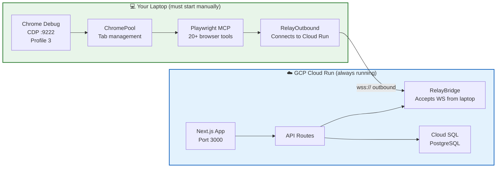
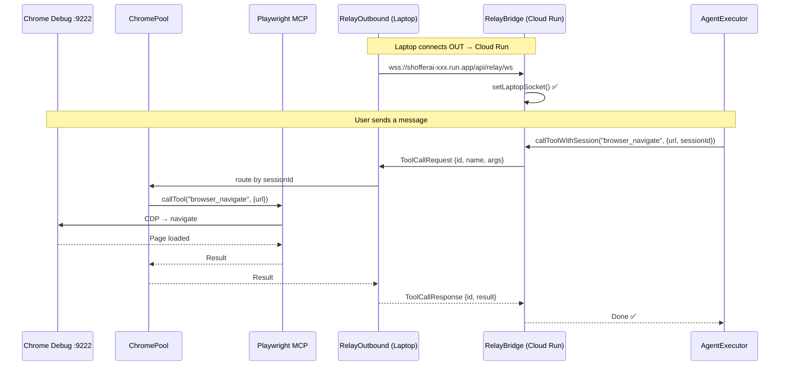
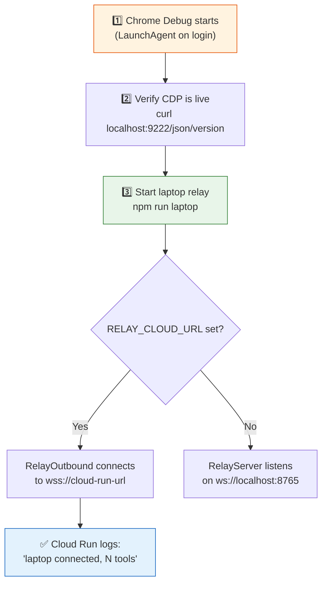

# ShofferAI — Deployment Guide: Cloud vs Laptop

> **Last Updated**: March 19, 2026

This document explains exactly what runs where, what you need to start on your laptop, and how the two environments connect.

---

## At a Glance




---

## What Runs Where

### ☁️ Cloud Run (Production — Always On)

Everything in the Docker container. **No browser, no Playwright.**

| Component | What It Does | File |
|-----------|-------------|------|
| **Next.js App** | Chat UI, auth pages, dashboard | `apps/web/` |
| **custom-server.js** | Node server with WebSocket upgrade for relay | `apps/web/custom-server.js` |
| **API Routes** | `/api/agent/execute`, `/api/payments/*`, `/api/auth/*` | `apps/web/app/api/` |
| **RelayBridge** | Accepts incoming WebSocket from laptop | `apps/web/lib/relay-bridge.ts` |
| **AgentExecutor** | LLM loop (Azure OpenAI), skill matching | `packages/agent-core/` |
| **WorkflowEngine** | Task state machine, pause/resume | `apps/web/lib/workflow-engine/` |
| **CredentialVault** | AES-256-GCM encrypted credential storage | `apps/web/lib/credential-vault/` |
| **Prisma Client** | Database access | `prisma/` |
| **Cloud SQL** | PostgreSQL 16 (managed) | GCP Console |

**Dockerfile highlights:**
```dockerfile
FROM node:20-alpine              # Slim — no Chrome, no Playwright
ENV RELAY_MODE=cloud             # Uses RelayBridge, not RemoteMCPHost
CMD ["node", "apps/web/server.js"]  # custom-server.js with WS support
```

**What's NOT on Cloud Run:** Chrome, Playwright, CDP, any browser automation.

---

### 💻 Your Laptop (Must Start Manually)

Everything browser-related. **This is where the actual web tasks happen.**

| Component | What It Does | How to Start |
|-----------|-------------|-------------|
| **Chrome Debug** | Persistent Chrome with signed-in profiles | LaunchAgent (auto) or `scripts/start-debug-chrome.sh` |
| **ChromePool** | Manages Chrome instances + per-task tab isolation | Started by `npm run laptop` |
| **Playwright MCP** | 20+ browser tools (click, type, navigate, snapshot...) | Started by `npm run laptop` |
| **RelayOutbound** | Connects OUT to Cloud Run via WSS | Started by `npm run laptop` (when `RELAY_CLOUD_URL` is set) |
| **RelayServer** | Accepts connections from local dev (port 8765) | Started by `npm run laptop` (when `RELAY_CLOUD_URL` is NOT set) |

---

## How They Connect



**Connection modes (determined by env vars on laptop):**

| Env Var | Mode | Who Connects | Use Case |
|---------|------|-------------|----------|
| `RELAY_CLOUD_URL` is set | **Outbound** | Laptop → Cloud Run (WSS) | **Production** |
| `RELAY_CLOUD_URL` is NOT set | **Server** | Cloud Run → Laptop (WS :8765) | **Local dev** |

---

## Startup Sequence

### For Production (your laptop talks to Cloud Run)




**Step-by-step:**

```bash
# ── Step 1: Chrome Debug (usually auto-starts on login) ──
# Verify it's running:
curl -s http://localhost:9222/json/version | head -5

# If not running, start manually:
bash apps/playwright/scripts/start-debug-chrome.sh

# ── Step 2: Start the laptop relay ──
# Set these env vars (or put in .env):
export RELAY_CLOUD_URL=wss://shofferai-27188185100.asia-south1.run.app/api/relay/ws
export RELAY_AUTH_TOKEN=<your-token>

# Start:
npm run laptop
# → Initializes ChromePool
# → Connects to Cloud Run via WSS
# → Logs: "Connected to Cloud Run — ready for tool calls."

# ── Step 3: Verify connection ──
# Check Cloud Run logs for:
#   "[relay-bridge] Laptop connected, 20+ tools available"
```

### For Local Development

```bash
# Terminal 1: Start Chrome Debug
bash apps/playwright/scripts/start-debug-chrome.sh

# Terminal 2: Start laptop relay (server mode — no RELAY_CLOUD_URL)
npm run laptop
# → RelayServer listens on ws://localhost:8765

# Terminal 3: Start Next.js dev server
cd apps/web && npx next dev
# → RemoteMCPHost connects OUT to ws://localhost:8765
```

---

## Environment Variables

### ☁️ Cloud Run

| Variable | Required | Description |
|----------|----------|-------------|
| `RELAY_MODE` | ✅ | **`cloud`** — uses RelayBridge (accepts laptop WS) |
| `RELAY_AUTH_TOKEN` | ✅ | Shared secret — **must match laptop** |
| `DATABASE_URL` | ✅ | Cloud SQL connection string |
| `AZURE_OPENAI_ENDPOINT` | ✅ | Azure OpenAI resource URL |
| `AZURE_OPENAI_API_KEY` | ✅ | Azure OpenAI API key |
| `LLM_MODEL` | ✅ | Azure deployment name (e.g. `gpt-4o-mini`) |
| `AUTH_SECRET` | ✅ | NextAuth JWT secret |
| `GOOGLE_CLIENT_ID` | ✅ | Google OAuth client ID |
| `GOOGLE_CLIENT_SECRET` | ✅ | Google OAuth client secret |
| `RAZORPAY_KEY_ID` | ✅ | Razorpay key |
| `RAZORPAY_KEY_SECRET` | ✅ | Razorpay secret |
| `NEXT_PUBLIC_RAZORPAY_KEY_ID` | ✅ | Razorpay client-side key |
| `NEXTAUTH_URL` | ✅ | Production URL |

### 💻 Laptop

| Variable | Required | Description |
|----------|----------|-------------|
| `RELAY_CLOUD_URL` | For prod | `wss://shofferai-xxx.run.app/api/relay/ws` |
| `RELAY_AUTH_TOKEN` | ✅ | Shared secret — **must match Cloud Run** |
| `RELAY_PORT` | No | Local server port (default: `8765`) |
| `CHROME_CDP_ENDPOINT` | No | CDP URL (default: `http://localhost:9222`) |
| `POOL_SIZE` | No | Number of Chrome slots (default: `3`) |
| `PLAYWRIGHT_HEADLESS` | No | Set `true` for headless (default: headed) |

> ⚠️ **RELAY_AUTH_TOKEN must be identical** on Cloud Run and laptop. Mismatched tokens = silent connection failures.

---

## What Breaks Without the Laptop

| Scenario | What Happens |
|----------|-------------|
| **Laptop off, Chrome not running** | All browser tasks fail. Chat UI works, LLM responds, but any `browse_website` tool call errors with "Browser relay disconnected" |
| **Chrome running, relay not started** | Same as above — no relay means no tool execution |
| **Relay connected, wrong Chrome profile** | Agent can browse but has no signed-in sessions. Booking.com shows as guest, Blinkit blocks checkout |
| **Token mismatch** | WebSocket connection silently rejected. Cloud Run logs: "relay auth failed" |
| **Laptop disconnects mid-task** | Current task fails. RelayOutbound auto-reconnects (1s, 2s, 4s... max 30s). Next task works |

**What still works without laptop:** Chat UI, auth, payment history, profile management, task history — everything that doesn't need browser automation.

---

## Chrome Profile Setup (One-Time)

```bash
# The debug Chrome must use Profile 3 for signed-in sessions
# Launch with specific profile:
/Applications/Google\ Chrome.app/Contents/MacOS/Google\ Chrome \
  --remote-debugging-port=9222 \
  --user-data-dir="$HOME/Library/Application Support/Google/Chrome-Debug" \
  --profile-directory="Profile 3"

# Profiles in Chrome-Debug:
# Default  — empty, no account
# Profile 1 — rsinghtomar54@gmail.com
# Profile 3 — rsinghtomar3011@gmail.com (Booking.com Genius) ← USE THIS
# Profile 4 — rohit30.iitkgp@gmail.com (wrong account)
```

**First-time setup:** Open Chrome Debug, manually sign into booking.com, blinkit.com, etc. Sessions persist across restarts (cookies stored in OS keychain).

---

## Quick Reference Card

```
┌──────────────────────────────────────────────────────────────┐
│                    PRODUCTION CHECKLIST                        │
├──────────────────────────────────────────────────────────────┤
│                                                              │
│  ☁️ CLOUD RUN (auto)          💻 LAPTOP (manual)             │
│  ─────────────────           ───────────────────             │
│  ✅ Next.js App               ☐ Chrome Debug on :9222        │
│  ✅ API Routes                ☐ Profile 3 signed in          │
│  ✅ RelayBridge               ☐ npm run laptop               │
│  ✅ Cloud SQL                 ☐ RELAY_CLOUD_URL set          │
│  ✅ Azure OpenAI              ☐ RELAY_AUTH_TOKEN matches      │
│                                                              │
│  VERIFY: Cloud Run logs show "laptop connected"              │
│                                                              │
├──────────────────────────────────────────────────────────────┤
│                    LOCAL DEV CHECKLIST                         │
├──────────────────────────────────────────────────────────────┤
│                                                              │
│  Terminal 1: start-debug-chrome.sh    → Chrome :9222         │
│  Terminal 2: npm run laptop           → RelayServer :8765    │
│  Terminal 3: cd apps/web && npx next dev → Next.js :3000     │
│                                                              │
│  No RELAY_CLOUD_URL needed for local dev                     │
└──────────────────────────────────────────────────────────────┘
```
