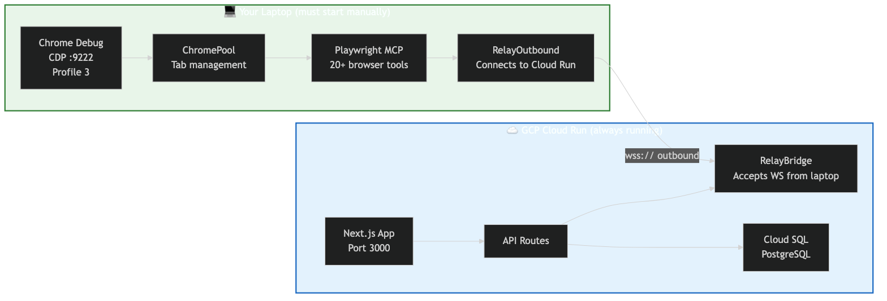
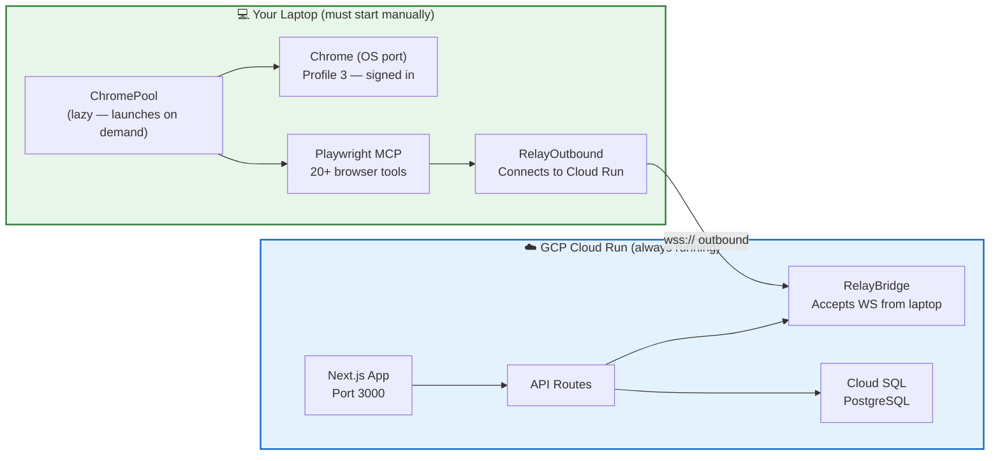
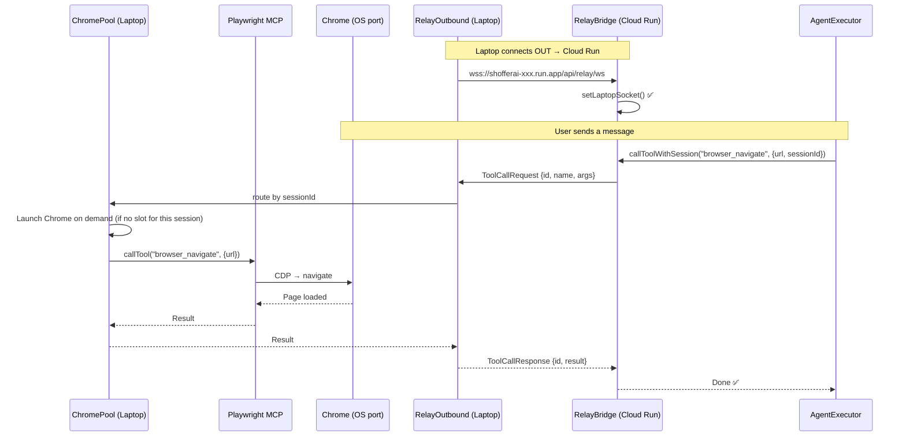
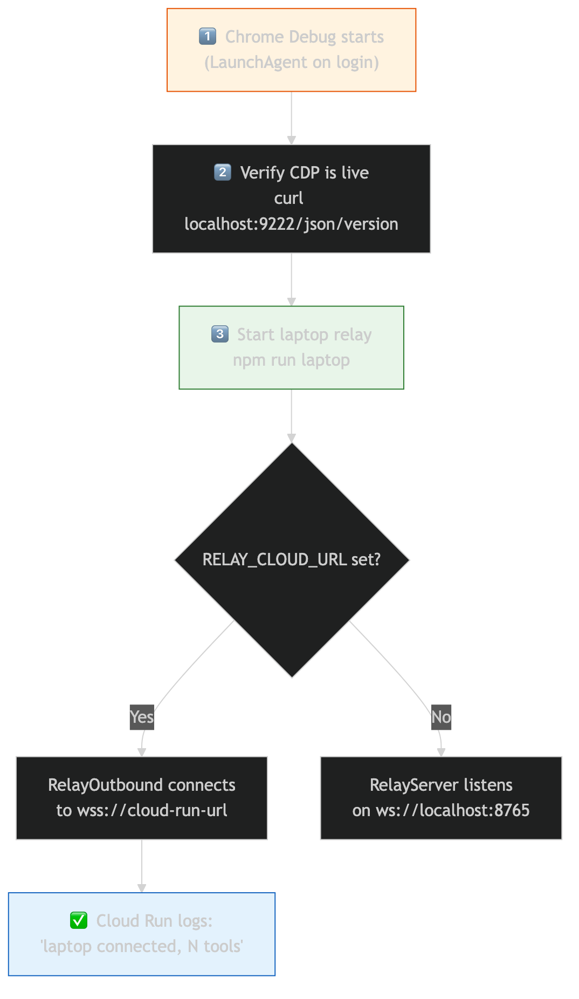
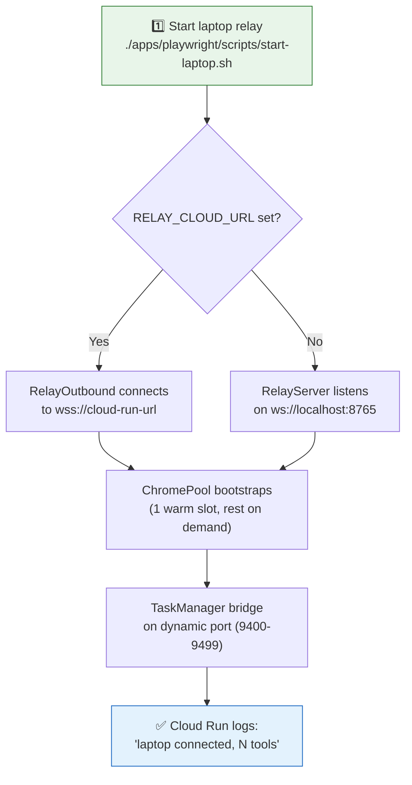

# ShofferAI — Deployment Guide: Cloud vs Laptop

> **Last Updated**: March 21, 2026

This document explains exactly what runs where, what you need to start on your laptop, and how the two environments connect.

---

## At a Glance





---

## What Runs Where

### ☁️ Cloud Run (Production — Always On)

Everything in the Docker container. **No browser, no Playwright.**

| Component | What It Does | File |
|-----------|-------------|------|
| **Next.js App** | Chat UI, auth pages, dashboard | `apps/web/` |
| **custom-server.js** | Node server with WebSocket upgrade for relay | `apps/web/custom-server.js` |
| **API Routes** | `/api/agent/execute`, `/api/payments/*`, `/api/auth/*` | `apps/web/app/api/` |
| **RelayBridge** | Accepts incoming WebSocket from laptop | `apps/web/lib/relay-bridge.ts` |
| **AgentExecutor** | LLM loop (Azure OpenAI), skill matching | `packages/agent-core/` |
| **WorkflowEngine** | Task state machine, pause/resume | `apps/web/lib/workflow-engine/` |
| **CredentialVault** | AES-256-GCM encrypted credential storage | `apps/web/lib/credential-vault/` |
| **Prisma Client** | Database access | `prisma/` |
| **Cloud SQL** | PostgreSQL 16 (managed) | GCP Console |

#### Cloud SQL Instance Details

| Property | Value |
|----------|-------|
| **Instance name** | `shofferai-db` |
| **Version** | PostgreSQL 15 |
| **Tier** | `db-f1-micro` (shared CPU, 614 MB RAM) |
| **Region** | `asia-south1` (same as Cloud Run) |
| **Disk** | 10 GB SSD |
| **Connection name** | `docx-healthcare:asia-south1:shofferai-db` |
| **Database** | `shofferai` |
| **User** | `postgres` |
| **Public IP** | Enabled (no authorized networks — access via Cloud SQL connector only) |
| **SSL** | Allow unencrypted (Cloud Run uses Unix socket, not TCP) |

**Cloud Run connects via Unix socket** (`/cloudsql/docx-healthcare:asia-south1:shofferai-db`) — no public IP access needed. The `cloudsql-instances` annotation on the Cloud Run service enables this automatically.

**Tables (13):** User, Account, Session, VerificationToken, Profile, Credential, Task, TaskStep, Message, Payment, SkillLesson, TelemetryEvent, PendingInput

**Migrations:**
```bash
# Apply pending migrations to prod (from laptop with cloud-sql-proxy or authorized network)
DATABASE_URL="postgresql://postgres:<password>@34.180.24.248/shofferai" npx prisma migrate deploy

# Or via Cloud Run container startup (automatic — see Dockerfile CMD)
```

**Temporary direct access (for debugging):**
```bash
# 1. Authorize your IP
MY_IP=$(curl -4 -s ifconfig.me)
gcloud sql instances patch shofferai-db --authorized-networks="${MY_IP}/32" --quiet

# 2. Connect
DATABASE_URL="postgresql://postgres:<password>@34.180.24.248/shofferai" npx prisma studio

# 3. ALWAYS remove access after
gcloud sql instances patch shofferai-db --clear-authorized-networks --quiet
```

**Dockerfile highlights:**
```dockerfile
FROM node:20-alpine              # Slim — no Chrome, no Playwright
ENV RELAY_MODE=cloud             # Uses RelayBridge, not RemoteMCPHost
CMD ["node", "apps/web/server.js"]  # custom-server.js with WS support
```

**Deploying:** `gcloud builds submit --config cloudbuild.yaml` — runs entirely in GCP Cloud Build (no local Docker needed). Uploads source, builds remotely, pushes to Artifact Registry, deploys to Cloud Run.

**Relay auto-heal during deploys:** The `cloudbuild.yaml` pipeline has 3 steps:
1. **Build** (Kaniko) — Docker image with layer caching
2. **Pre-deploy relay release** — Curls `POST /api/admin/release-relay` on the current instance to force-close the laptop WS. The laptop auto-reconnects within 1-4s. Without this, the laptop stays connected to the old instance (Cloud Run treats the WS as an "active request" and keeps the old instance alive for up to `--timeout=3600s`), while new HTTP requests route to the new instance.
3. **Deploy** — `gcloud run deploy` with the new image

**Five-layer defense against stale relay connections:**
1. **Draining guard** (`custom-server.js`): On SIGTERM, sets a `draining` flag and rejects all new WS upgrade requests with HTTP 503. This prevents the laptop from reconnecting to the dying instance during the 1-4s window between disconnect and new instance readiness.
2. **`server_draining` message** (`relay-bridge.ts`): On SIGTERM, `gracefulClose()` sends `{ type: 'server_draining' }` to the laptop before the WS close frame. Laptop immediately terminates and reconnects with 1s delay.
3. **Hard terminate** (`custom-server.js`): After graceful close (1001), force-terminates the WS after 2s to ensure the connection is fully severed before the instance dies.
4. **Stale detection** (`relay-outbound.ts`): If no application-level message for 25s (server heartbeats every 15s), terminates and reconnects — catches cases where the pre-deploy curl and draining guard both fail.
5. **HTTP phantom detection** (`relay-outbound.ts`): Every 30s (and 8s after connect), the laptop GETs `/api/admin/relay-status` via HTTP. HTTP always routes to the ACTIVE instance. If it returns `connected: false` but the WS is open → phantom → terminate → reconnect. **This is the definitive fix for FM2** (draining instance still sending heartbeat pings that fool the stale check).

**Why all five layers are needed:** Cloud Run keeps draining instances alive for active connections. The draining instance IS a real server — it sends real `{ type: 'ping' }` JSON every 15s, which keeps `lastAppMessageAt` fresh and prevents the stale check from firing (FM2). The HTTP verify catches this because HTTP routes to the ACTIVE instance, not the draining one.

**What's NOT on Cloud Run:** Chrome, Playwright, CDP, any browser automation.

---

### 💻 Your Laptop (Must Start Manually)

Everything browser-related. **This is where the actual web tasks happen.**

> ⚠️ **CRITICAL: Only ONE relay instance may run at a time.** Running two instances causes WebSocket flapping on Cloud Run — tasks will fail. `start-laptop.sh` auto-kills existing instances, but if you use the LaunchAgent daemon, do NOT also run `start-laptop.sh` manually.

| Component | What It Does | How to Start |
|-----------|-------------|-------------|
| **ChromePool** | Launches Chrome instances on demand (lazy) with signed-in Profile 3 | Started by `start-laptop.sh` |
| **Playwright MCP** | 20+ browser tools (click, type, navigate, snapshot...) | Started by `start-laptop.sh` |
| **RelayOutbound** | Connects OUT to Cloud Run via WSS | Started by `start-laptop.sh` (when `RELAY_CLOUD_URL` is set) |
| **RelayServer** | Accepts connections from local dev (port 8765) | Started by `start-laptop.sh` (when `RELAY_CLOUD_URL` is NOT set) |
| **TaskManager** | Bridge WS for Copilot CLI tasks (dynamic port 9400-9499) | Always started by `start-laptop.sh` (both modes) |

> **No manual Chrome launch needed.** ChromePool handles everything — it clones the Chrome-Debug profile, launches Chrome with an OS-assigned port, and connects Playwright MCP automatically.
>
> **⚠️ IMPORTANT:** Chrome MUST be launched without Playwright's default `--use-mock-keychain` flag. This flag blocks macOS Keychain access, making all encrypted cookies unreadable (every site appears logged out). Both ChromePool and `playwright-mcp-with-chrome.sh` launch Chrome directly (not via Playwright) to avoid this.
>
> **⚠️ Lazy launch:** For Copilot CLI, `.mcp.json` uses `lazy-playwright-proxy.mjs` which defers Chrome until the first browser tool call. This means `gh copilot` starts instantly without Chrome. The proxy spawns `playwright-mcp-with-chrome.sh` on demand.

### Profile 3 Session Management

Profile 3 is pre-authenticated on **12 P0 sites**: Blinkit, Swiggy, Zomato, Booking.com, Amazon, Flipkart, BigBasket, Zepto, JioMart, Myntra, Nykaa, Croma.

```bash
# Verify all sessions are still valid (copies profile, checks all 12 sites)
npx tsx apps/playwright/scripts/check-p0-sessions.ts

# If a site's session has expired, re-authenticate in the BASE profile:
"/Applications/Google Chrome.app/Contents/MacOS/Google Chrome" \
  --user-data-dir="$HOME/Library/Application Support/Google/Chrome-Debug" \
  --profile-directory="Profile 3" \
  --no-first-run --disable-sync \
  "https://example.com"   # the expired site
# Sign in → ⌘Q → cookies flush → ChromePool inherits
```

> ⚠️ **NEVER sign into websites via Playwright MCP or automated browsers.** Those are temp copies — sign-ins don't persist back to the base profile. See `REPEATING-MISTAKES.md` Rule 38.

---

## How They Connect



**Connection modes (determined by env vars on laptop):**

| Env Var | Mode | Who Connects | Use Case |
|---------|------|-------------|----------|
| `RELAY_CLOUD_URL` is set | **Outbound** | Laptop → Cloud Run (WSS) | **Production** (no port 8765, TaskManager on dynamic port) |
| `RELAY_CLOUD_URL` is NOT set | **Server** | Cloud Run → Laptop (WS :8765) | **Local dev** (TaskManager on dynamic port) |

---

## Startup Sequence

### For Production (your laptop talks to Cloud Run)





**Step-by-step:**

```bash
# ── Just run the start script — it handles everything ──
./apps/playwright/scripts/start-laptop.sh

# What happens automatically:
# → ChromePool launches 1 bootstrap Chrome (Profile 3, OS-assigned port)
# → Discovers 22 Playwright MCP tools
# → Connects to Cloud Run via WSS
# → Chrome launches on demand when tasks arrive
# → Chrome is torn down when idle (15 min)

# ── Verify connection ──
# Check Cloud Run logs for:
#   "[relay-bridge] Laptop connected, 20+ tools available"
```

### For Local Development

```bash
# Terminal 1: Start laptop relay (server mode — no RELAY_CLOUD_URL)
./apps/playwright/scripts/start-laptop.sh
# → RelayServer listens on ws://localhost:8765
# → TaskManager bridge on dynamic port (9400-9499, printed in logs)

# Terminal 2: Start Next.js dev server
cd apps/web && npx next dev
# → RemoteMCPHost connects OUT to ws://localhost:8765
```

---

## Environment Variables

### ☁️ Cloud Run

| Variable | Required | Description |
|----------|----------|-------------|
| `RELAY_MODE` | ✅ | **`cloud`** — uses RelayBridge (accepts laptop WS) |
| `RELAY_AUTH_TOKEN` | ✅ | Shared secret — **must match laptop** |
| `DATABASE_URL` | ✅ | Cloud SQL via Unix socket: `postgresql://postgres:<pw>@localhost/shofferai?host=/cloudsql/docx-healthcare:asia-south1:shofferai-db` |
| `AZURE_OPENAI_ENDPOINT` | ✅ | Azure OpenAI resource URL |
| `AZURE_OPENAI_API_KEY` | ✅ | Azure OpenAI API key |
| `LLM_MODEL` | ✅ | Azure deployment name (e.g. `gpt-4o-mini`) |
| `AUTH_SECRET` | ✅ | NextAuth JWT secret |
| `GOOGLE_CLIENT_ID` | ✅ | Google OAuth client ID |
| `GOOGLE_CLIENT_SECRET` | ✅ | Google OAuth client secret |
| `RAZORPAY_KEY_ID` | ✅ | Razorpay key |
| `RAZORPAY_KEY_SECRET` | ✅ | Razorpay secret |
| `NEXT_PUBLIC_RAZORPAY_KEY_ID` | ✅ | Razorpay client-side key |
| `NEXTAUTH_URL` | ✅ | Production URL |

### 💻 Laptop

| Variable | Required | Description |
|----------|----------|-------------|
| `RELAY_CLOUD_URL` | For prod | `wss://shofferai-xxx.run.app/api/relay/ws` |
| `RELAY_AUTH_TOKEN` | ✅ | Shared secret — **must match Cloud Run** |
| `RELAY_PORT` | No | Local server port for server/dev mode (default: `8765`). Not used in outbound/prod mode. |
| `POOL_SIZE` | No | Max concurrent Chrome slots (default: `3`) |

> ⚠️ **RELAY_AUTH_TOKEN must be identical** on Cloud Run and laptop. Mismatched tokens = silent connection failures.

---

## What Breaks Without the Laptop

| Scenario | What Happens |
|----------|-------------|
| **Laptop off, Chrome not running** | All browser tasks fail. Chat UI works, LLM responds, but any `browse_website` tool call errors with "Browser relay disconnected" |
| **Chrome running, relay not started** | Same as above — no relay means no tool execution |
| **Relay connected, wrong Chrome profile** | Agent can browse but has no signed-in sessions. Booking.com shows as guest, Blinkit blocks checkout |
| **Token mismatch** | WebSocket connection silently rejected. Cloud Run logs: "relay auth failed" |
| **Laptop disconnects mid-task** | Current task fails. RelayOutbound auto-reconnects (1s, 2s, 4s... max 30s). Next task works |

**What still works without laptop:** Chat UI, auth, payment history, profile management, task history — everything that doesn't need browser automation.

---

## Chrome Profile Setup (One-Time)

ChromePool automatically clones the Chrome-Debug profile directory for each Chrome instance it launches. You only need to set up the base profile once:

```bash
# Launch the base Chrome-Debug with Profile 3:
/Applications/Google\ Chrome.app/Contents/MacOS/Google\ Chrome \
  --user-data-dir="$HOME/Library/Application Support/Google/Chrome-Debug" \
  --profile-directory="Profile 3"

# Profiles in Chrome-Debug:
# Default  — empty, no account
# Profile 1 — rsinghtomar54@gmail.com
# Profile 3 — rsinghtomar3011@gmail.com (Booking.com Genius) ← USE THIS
# Profile 4 — rohit30.iitkgp@gmail.com (wrong account)
```

**First-time setup:** Open Chrome Debug, manually sign into booking.com, blinkit.com, etc. Sessions persist across restarts (cookies encrypted via macOS Keychain, per-user — so cloned profiles inherit all sessions automatically).

---

## Quick Reference Card

```
┌──────────────────────────────────────────────────────────────┐
│                    PRODUCTION CHECKLIST                        │
├──────────────────────────────────────────────────────────────┤
│                                                              │
│  ☁️ CLOUD RUN (auto)          💻 LAPTOP (manual or daemon)    │
│  ─────────────────           ───────────────────             │
│  ✅ Next.js App               ☐ ./start-laptop.sh            │
│  ✅ API Routes                  (launches Chrome + relay     │
│  ✅ RelayBridge                  automatically)              │
│  ✅ Cloud SQL                 ☐ RELAY_AUTH_TOKEN matches      │
│  ✅ Azure OpenAI                                             │
│                                                              │
│  VERIFY: Cloud Run logs show "laptop connected"              │
│                                                              │
├──────────────────────────────────────────────────────────────┤
│                    LOCAL DEV CHECKLIST                         │
├──────────────────────────────────────────────────────────────┤
│                                                              │
│  Terminal 1: ./start-laptop.sh       → RelayServer :8765     │
│             (TaskManager bridge on dynamic port 9400-9499)    │
│  Terminal 2: cd apps/web && npx next dev → Next.js :3000     │
│                                                              │
│  No RELAY_CLOUD_URL needed for local dev                     │
└──────────────────────────────────────────────────────────────┘
```

---

## Running Forever (Auto-Start on Boot)

### ☁️ Cloud Run — Already Runs Forever

Cloud Run automatically:
- Starts your container when traffic arrives
- Restarts if it crashes
- Scales 0→3 instances based on load
- No action needed — it just works

### 💻 Laptop Relay — macOS LaunchAgent

> ⚠️ **WARNING: Only ONE relay instance may run at a time.** Running both the LaunchAgent daemon AND `start-laptop.sh` manually creates two processes that fight over Cloud Run's WebSocket, causing an infinite connect/disconnect flapping loop. Use ONE method:
> - **Option A (recommended):** `start-laptop.sh` — interactive, visible logs in terminal. It auto-kills existing processes and stops the LaunchAgent.
> - **Option B:** LaunchAgent — hands-off daemon mode. Do NOT also run `start-laptop.sh`.

The relay uses a **macOS LaunchAgent** to auto-start on login and restart on crash.

**Files involved:**

| File | Purpose |
|------|---------|
| `~/Library/LaunchAgents/com.shofferai.relay.plist` | macOS daemon config — auto-start on login |
| `apps/playwright/scripts/start-relay-daemon.sh` | Daemon entry point — loads nvm, sets env vars, runs relay |
| `/tmp/shofferai-relay.log` | stdout logs |
| `/tmp/shofferai-relay-error.log` | stderr logs |

**How it works:**
- `RunAtLoad: true` → Starts automatically when you log in
- `KeepAlive.SuccessfulExit: false` → Restarts if the process crashes (exit code ≠ 0)
- `ThrottleInterval: 30` → Waits 30 seconds between restart attempts (prevents crash loops)
- ChromePool handles all Chrome lifecycle — no separate Chrome daemon needed

**Setup (one-time):**

```bash
# 1. Ensure the plist exists
cat ~/Library/LaunchAgents/com.shofferai.relay.plist
# If missing, create it (see below)

# 2. Load the daemon
launchctl load ~/Library/LaunchAgents/com.shofferai.relay.plist

# 3. Verify it's running
launchctl list | grep shofferai
# Should show:  <PID>  0  com.shofferai.relay

# 4. Check logs
tail -20 /tmp/shofferai-relay.log
tail -20 /tmp/shofferai-relay-error.log
```

**The plist:**
```xml
<?xml version="1.0" encoding="UTF-8"?>
<!DOCTYPE plist PUBLIC "-//Apple//DTD PLIST 1.0//EN"
  "http://www.apple.com/DTDs/PropertyList-1.0.dtd">
<plist version="1.0">
<dict>
    <key>Label</key>
    <string>com.shofferai.relay</string>
    <key>ProgramArguments</key>
    <array>
        <string>/bin/bash</string>
        <string>/Users/rohit/shofferAi/apps/playwright/scripts/start-relay-daemon.sh</string>
    </array>
    <key>RunAtLoad</key>
    <true/>
    <key>KeepAlive</key>
    <dict>
        <key>SuccessfulExit</key>
        <false/>
    </dict>
    <key>ThrottleInterval</key>
    <integer>30</integer>
    <key>StandardOutPath</key>
    <string>/tmp/shofferai-relay.log</string>
    <key>StandardErrorPath</key>
    <string>/tmp/shofferai-relay-error.log</string>
</dict>
</plist>
```

**Common operations:**

```bash
# Check status
launchctl list | grep shofferai

# View live logs
tail -f /tmp/shofferai-relay.log

# Restart the relay
launchctl stop com.shofferai.relay   # KeepAlive auto-restarts it

# Stop completely (until next login)
launchctl unload ~/Library/LaunchAgents/com.shofferai.relay.plist

# Re-enable
launchctl load ~/Library/LaunchAgents/com.shofferai.relay.plist
```

> ⚠️ **Obsolete: `com.shofferai.chrome-debug.plist`** — This used to launch Chrome separately on port 9222. No longer needed — ChromePool launches Chrome on OS-assigned ports. If you still have it, disable it:
> ```bash
> launchctl unload ~/Library/LaunchAgents/com.shofferai.chrome-debug.plist
> mv ~/Library/LaunchAgents/com.shofferai.chrome-debug.plist \
>    ~/Library/LaunchAgents/com.shofferai.chrome-debug.plist.disabled
> ```

### What Keeps Everything Alive

```
┌───────────────────────────────────────────────────────────┐
│  COMPONENT          │  KEPT ALIVE BY          │  RESTARTS │
├─────────────────────┼─────────────────────────┼───────────┤
│  Cloud Run app      │  GCP Cloud Run          │  Auto     │
│  Cloud SQL          │  GCP managed service    │  Auto     │
│  Laptop relay       │  macOS LaunchAgent      │  Auto     │
│  Chrome instances   │  ChromePool (on demand) │  On task  │
│  WSS connection     │  RelayOutbound reconnect│  Auto     │
└───────────────────────────────────────────────────────────┘
```

**Edge cases handled:**
- **Laptop sleeps**: Relay reconnects when laptop wakes (RelayOutbound has exponential backoff: 1s, 2s, 4s... max 30s)
- **Relay crashes**: LaunchAgent restarts within 30 seconds
- **Chrome crashes**: ChromePool detects it, marks slot as error, launches new Chrome on next task
- **Cloud Run cold start**: First request after idle may take 5-10 seconds (container boots)
- **Token expires**: If Chrome session cookies expire, open Chrome-Debug base profile manually, re-login, ChromePool picks up new sessions on next clone
