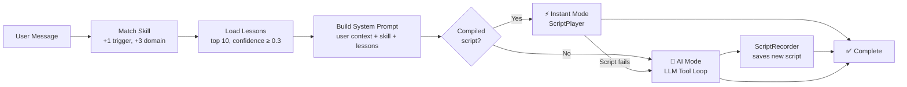
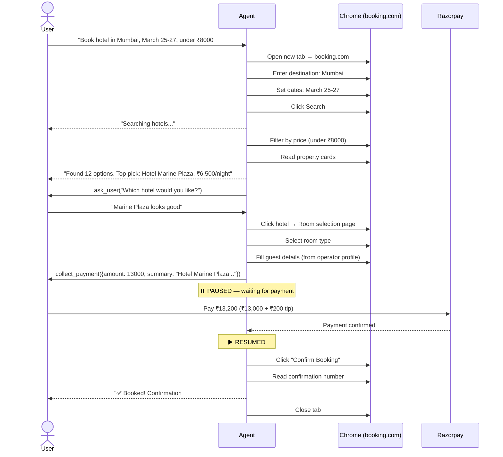
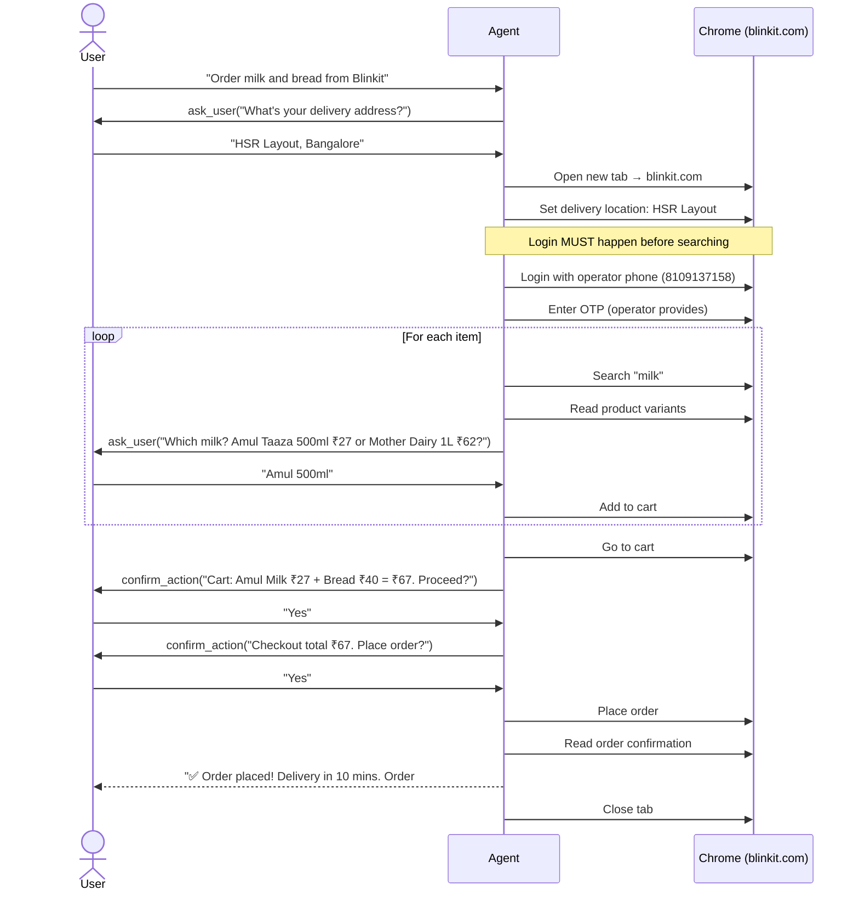
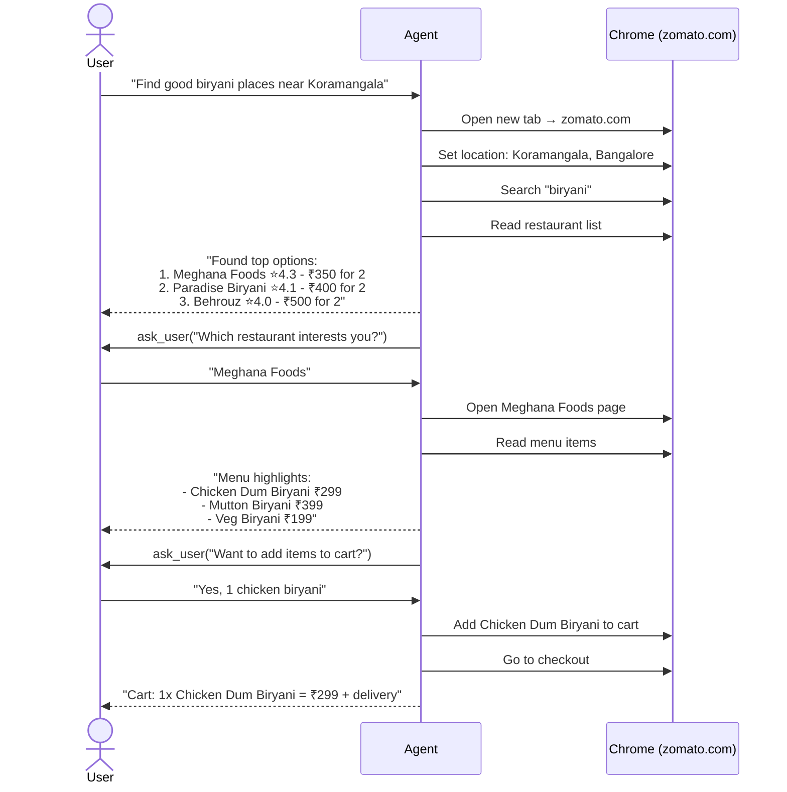
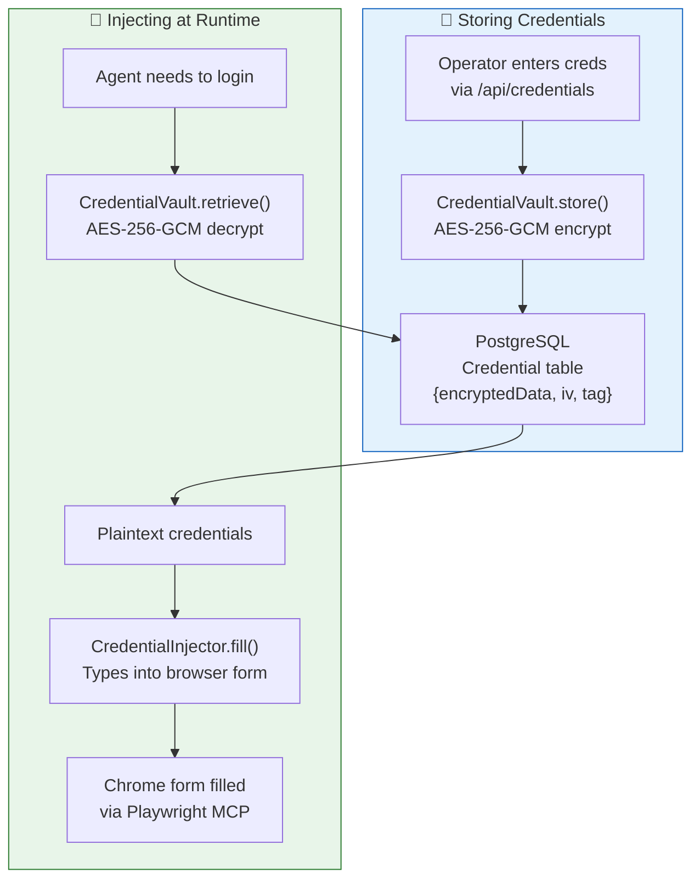
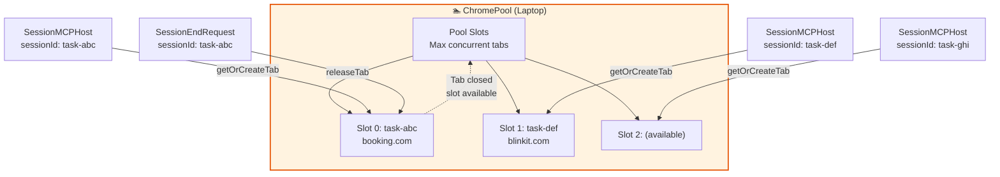
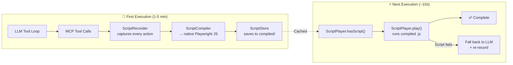

# ShofferAI — E2E Workflows

> **Version**: 1.1
> **Last Updated**: March 19, 2026

---

## Agent Execution Pipeline

Every user request follows this pipeline:



### Execution Modes

| Mode | When | How | Speed |
|------|------|-----|-------|
| **Instant** | Compiled script exists for skill | `ScriptPlayer` replays pre-recorded Playwright steps | ~10s |
| **AI** | No script, or script failed | LLM reasons + calls MCP tools (max 50 iterations) | 1-5 min |
| **Hybrid** | Script fails mid-execution | Falls back to AI mode + `ScriptRecorder` captures new script | Variable |

---

## Workflow 1: Hotel Booking (Booking.com)

**Skill**: `booking-com-hotel`
**Triggers**: "book hotel", "find hotel", "booking.com", "accommodation"



**Booking.com Key Selectors:**
```
[data-testid="property-card"]              → hotel search result card
[data-testid="title"]                      → hotel name
[data-testid="price-and-discounted-price"] → price
[data-testid="review-score"]               → review score
[data-testid="title-link"]                 → hotel detail link
[data-testid="user-details-firstname"]     → first name field
[data-testid="user-details-lastname"]      → last name field
[data-testid="user-details-email"]         → email field
[data-testid="phone-number-input"]         → phone field
```

**Files:**
- `packages/agent-core/src/scripts/compiled/booking-com-hotel.v2.json` — 13-step declarative skill
- `packages/agent-core/src/scripts/compiled/booking-com-hotel.ts` — Compiled Playwright script

---

## Workflow 2: Grocery Ordering (Blinkit)

**Skill**: `blinkit-grocery`
**Triggers**: "order groceries", "blinkit", "quick delivery", "10 minutes"



**Critical Notes:**
- **Login FIRST** — Blinkit blocks checkout without login
- **Location popup** — First thing Blinkit shows; set address before anything else
- **OTP goes to operator** — Phone 8109137158, not user's phone
- **Min order** — Usually ₹99-149; warn user if below minimum
- Use `confirm_action` for cart review (no money), then again at checkout

**File:** `packages/agent-core/src/skills/blinkit-grocery/SKILL.md`

---

## Workflow 3: Restaurant Browsing (Zomato)

**Skill**: `zomato-restaurant`
**Triggers**: "zomato", "restaurant", "food delivery", "order food"



---

## Credential Vault Flow

How site credentials are stored and injected:



**Credential Types** (defined in `packages/shared/src/credentials.ts`):
- `SiteLoginData` — email/phone + password
- `CardData` — card number, expiry, CVV, cardholder
- `UPIData` — UPI ID
- `AddressData` — street, city, state, pincode, phone

---

## Chrome Pool & Tab Management



Each `sessionId` maps to exactly one Chrome tab. Tabs are created on demand and released when the task completes (via `SessionEndRequest`). This enables concurrent task execution without tab conflicts.

---

## Record → Compile → Replay Pipeline (Caching)

The core optimization that makes second-and-beyond executions **10x faster**. On first run, the LLM drives browser actions while `ScriptRecorder` captures every MCP tool call. On success, the recording is compiled to native Playwright code. Next time the same skill runs, `ScriptPlayer` replays the compiled script in ~10 seconds — no LLM needed.



### Pipeline Components

| Component | File | Role |
|-----------|------|------|
| **ScriptRecorder** | `packages/agent-core/src/scripts/recorder.ts` | Captures MCP tool calls, extracts selector hints, templatizes args |
| **ScriptCompiler** | `packages/agent-core/src/scripts/compiler.ts` | Converts RecordedAction[] → native Playwright JS with resilient `.or()` selectors |
| **ScriptPlayer** | `packages/agent-core/src/scripts/player.ts` | Executes compiled scripts as child processes, handles interactive flows (OTP, confirmations) via stdin/stdout JSON messaging |
| **ScriptStore** | `packages/agent-core/src/scripts/store.ts` | Persists compiled scripts to `compiled/` as `{skillId}.generated.js` + `{skillId}.v{N}.json` |

### What Gets Cached

- **MCP tool call sequences** — every `browser_navigate`, `browser_click`, `browser_type`, etc.
- **Stable selectors** — extracted from element descriptions (data-testid, roles, text)
- **Template bindings** — user-specific values replaced with `{{param}}` placeholders
- **Interactive markers** — OTP entry, user confirmations, credential fills marked as `interactive` actions
- **Auto-compiled Playwright code** — standalone .js files that run without LLM or MCP

### Interactive Flow Handling

Compiled scripts communicate with the agent via **stdin/stdout JSON protocol** during replay:

```
ScriptPlayer spawns → node compiled-script.js '{"destination":"Mumbai"}'
                        ↓
Script encounters OTP step → stdout: {"type":"need_input","prompt":"Enter OTP"}
                        ↓
ScriptPlayer → ask_user("Enter OTP") → user responds "123456"
                        ↓
ScriptPlayer → stdin: {"type":"input","value":"123456"}
                        ↓
Script continues execution...
```

### Current State

- **500 skills** with SKILL.md definitions in `packages/agent-core/src/skills/`
- **500+ compiled scripts** in `packages/agent-core/src/scripts/compiled/`
- Scripts stored as both `.ts` (TypeScript with exported constants) and `.generated.js` (auto-compiled)
- Compilation happens **on the laptop** where Playwright runs

---

## SSE Event Types

The agent streams events to the frontend via Server-Sent Events:

| Event Type | Payload | When |
|------------|---------|------|
| `message` | `{content: string}` | LLM natural-language text for the user |
| `step_update` | `{action, status}` | Milestone step completed (e.g. skill activation) |
| `input_required` | `{taskId, stepId, question, inputType, options?, ...}` | Agent needs user input (OTP, choice, address) |
| `payment_required` | `{taskId, bookingSummary, amountCents, ...}` | Agent wants to collect payment |
| `error` | `{error: string}` | Something went wrong |
| `complete` | `{summary: string}` | Task finished successfully |

### What the User Does NOT See

Internal tool calls and status labels are **filtered out** before reaching the chat UI:

| Suppressed Pattern | Example | Where Logged Instead |
|---|---|---|
| `Browser: <toolname>` | `Browser: report_intent` | `logger.info` in relay terminal |
| Raw tool names | `browser_navigate`, `mcp__playwright__browser_click` | `logger.info` in relay terminal |
| Status labels | `Agent starting...`, `Thinking...` | `logger.info` in relay terminal |
| Tool execution events | `assistant.tool_call`, `tool.execution_start` | `mcpToolEvents` → MCP log stream (dynamic port, printed in relay logs) |

**Three-layer filtering** prevents internal details from reaching users:
1. **task-manager.ts**: `isInternalToolLabel()` filters `assistant.message` events at the source
2. **execute/route.ts**: Defense-in-depth filter on `task_progress` before sending SSE
3. **ChatInterface.tsx**: Frontend hides `step_update` events with `status: 'running'`

The shared filter lives in `packages/shared/src/internal-message-filter.ts`.
